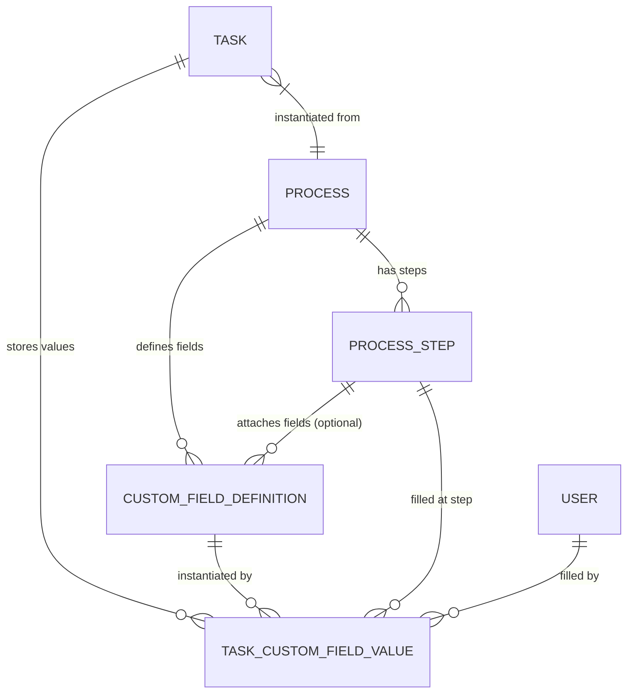

# Kế hoạch phát triển Hệ thống Quản lý Custom Fields cho Workflow Steps

Dựa trên tài liệu thiết kế [CustomFiles.md](file:///d:/Java%20lean/TestCase/Docs/CustomFiles.md), tài liệu này trình bày kế hoạch kiến trúc và lộ trình triển khai chi tiết cho hệ thống **Custom Fields động** được định nghĩa ở mức Quy trình (**Process**) và gắn vào từng Bước (**ProcessStep**) hoặc toàn bộ quy trình.

---

## 1. Tổng quan Kiến trúc Custom Fields

### Các loại Custom Fields hỗ trợ (22 loại):
1. **Văn bản**: `text` (1 dòng), `textarea` (nhiều dòng), `richtext` (Rich text/Markdown editor).
2. **Số liệu & Ngày tháng**: `number` (có min/max/step/unit), `date` (ngày), `datetime` (ngày giờ).
3. **Lựa chọn**: `select` (chọn 1), `multiselect` (chọn nhiều), `radio` (radio group), `checkbox` (checkbox list), `toggle` (bật/tắt boolean).
4. **Tập tin & Media**: `file` (1 file có validate dung lượng/định dạng), `multifile` (nhiều file).
5. **Người dùng**: `user` (chọn 1 user từ hệ thống có lọc theo role), `multiuser` (chọn nhiều user).
6. **Định dạng đặc biệt**: `email`, `phone`, `url`, `rating` (đánh giá sao ⭐), `slider` (thanh trượt), `color` (bảng chọn màu).
7. **Nâng cao**: `formula` (công thức tính toán tự động phụ thuộc vào các field khác), `visibility_condition` (ẩn/hiện có điều kiện dựa trên giá trị field khác).

---

## 2. Các giai đoạn triển khai (Phased Roadmap)

### Giai đoạn 1: Cơ sở dữ liệu (Database Schema & Migrations)
1. Cập nhật [schema.prisma](file:///d:/Java%20lean/TestCase/server/prisma/schema.prisma):
   - Thêm model `CustomFieldDefinition` (`custom_field_definitions`):
     - `id`: UUID (PK)
     - `processId`: UUID (FK -> `Process`)
     - `stepId`: UUID? (FK -> `ProcessStep`, null = áp dụng cho tất cả các bước)
     - `fieldKey`: String (`contract_value`, `partner_info`, ...) -> Unique theo `(processId, fieldKey)`
     - `fieldLabel`: String ("Giá trị hợp đồng", ...)
     - `fieldType`: String (`text`, `number`, `select`, `file`, `formula`, ...)
     - `fieldConfig`: Json (chứa `options`, `min`, `max`, `unit`, `acceptedTypes`, `formulaExpression`, ...)
     - `isRequired`: Boolean
     - `defaultValue`: Json?
     - `placeholder`: String?
     - `helpText`: String?
     - `order`: Int
     - `isVisible`: Boolean
     - `visibilityCondition`: Json?
     - `validationRules`: Json?
     - `createdById`, `updatedById`: UUID?
   - Thêm model `TaskCustomFieldValue` (`task_custom_field_values`):
     - `id`: UUID (PK)
     - `taskId`: UUID (FK -> `Task`)
     - `fieldDefinitionId`: UUID (FK -> `CustomFieldDefinition`)
     - `value`: Json? (chuỗi, số, mảng options, object metadata file, ...)
     - `stepId`: UUID? (FK -> `ProcessStep`)
     - `filledById`: UUID? (FK -> `User`)
     - `filledAt`: DateTime
     - `updatedById`: UUID?
     - Unique index theo `(taskId, fieldDefinitionId)`
   - Cập nhật quan hệ (Relations) trong `Process`, `ProcessStep`, `Task`, `User`.
   - Chạy `npx prisma db push` hoặc `prisma migrate`.

### Giai đoạn 2: Backend API & Business Logic
1. Tạo `customFieldService.ts` & `customFieldController.ts`:
   - `POST /api/processes/:processId/custom-fields`: Tạo mới Custom Field cho Process/Step (validate fieldKey unique trong process, validate cấu hình theo fieldType).
   - `GET /api/processes/:processId/custom-fields`: Lấy toàn bộ danh sách Custom Fields của Process (hỗ trợ query `stepId`).
   - `GET /api/custom-fields/:fieldId`: Lấy chi tiết một field.
   - `PUT /api/custom-fields/:fieldId`: Cập nhật cấu hình, label, validation rules, visibility.
   - `DELETE /api/custom-fields/:fieldId`: Xóa custom field (và dọn dẹp các giá trị liên kết).
   - `POST /api/processes/:processId/custom-fields/reorder`: Sắp xếp lại thứ tự `order` các field.
2. Tạo `taskCustomFieldService.ts` & `taskCustomFieldController.ts`:
   - `GET /api/tasks/:taskId/custom-fields`: Lấy các field hiển thị tại step hiện tại (hoặc tất cả các field của quy trình) kèm giá trị đã nhập trước đó.
   - `PUT /api/tasks/:taskId/custom-fields`: Lưu bulk giá trị custom fields:
     - Validate kiểu dữ liệu và ràng buộc `isRequired`, `min`, `max`, `pattern`, `acceptedTypes`.
     - Tự động tính toán các trường `formula` dựa trên các field phụ thuộc.
     - Lưu/cập nhật `TaskCustomFieldValue`.
     - Đồng bộ snapshot vào `TaskHistory` với `changeType = 'FIELD_UPDATED'`.
3. Tích hợp `TaskService`:
   - Cập nhật `getTaskById`, `createTask`, `transitionStep` tự động đính kèm `customFieldValues` và ghi snapshot đầy đủ.

### Giai đoạn 3: Frontend Custom Field Builder (Quản lý trường động trong Quy trình)
1. Mở rộng trang quản lý quy trình / popup quy trình ([ProcessModal.tsx](file:///d:/Java%20lean/TestCase/client/src/pages/Workflow/ProcessModal.tsx) hoặc Tab "Trường tùy chỉnh"):
   - Tab "Thiết lập bước" & Tab "Trường dữ liệu tùy chỉnh (Custom Fields)".
   - **`CustomFieldList`**: Hiển thị danh sách các field gom nhóm theo Step (hoặc "Áp dụng cho toàn bộ bước"), hỗ trợ kéo thả sắp xếp thứ tự.
   - **`CustomFieldEditorModal`**: Modal tạo/sửa custom field gồm:
     - Chọn `fieldType` trực quan với icon và badge phân loại.
     - Form thông tin cơ bản: Tên hiển thị (`fieldLabel`), Mã trường (`fieldKey`), Gán vào bước nào (`stepId`), Bắt buộc nhập (`isRequired`), Hướng dẫn (`helpText`).
     - Form cấu hình động (`FieldConfigEditor`):
       - Select/Radio/Checkbox: Quản lý danh sách Options (`label`, `value`).
       - Number/Slider: Nhập `min`, `max`, `step`, `unit` (VNĐ, USD, Kg...).
       - File/Multifile: Chọn định dạng file cho phép (`pdf`, `doc`, `docx`, `png`...) & dung lượng tối đa (MB).
       - User: Chọn bộ lọc vai trò (`ADMIN`, `MANAGER`, `USER`).
       - Formula: Nhập biểu thức tính toán (ví dụ: `price * quantity * (1 - discount / 100)`).
     - Điều kiện hiển thị (`VisibilityConditionEditor`): Thiết lập quy tắc hiển thị khi field A = giá trị X.
     - Live Preview Box: Xem trước ô nhập liệu hiển thị thực tế.

### Giai đoạn 4: Frontend Dynamic Form Renderer & Task Integration (Nhập & Hiển thị trên Task)
1. Xây dựng bộ component **`DynamicFormRenderer`**:
   - Tự động render UI tương ứng cho 22 loại input:
     - Input text, textarea, RichText (Markdown / WYSIWYG).
     - Number input có hiển thị đơn vị tiền tệ/đơn vị tính.
     - Date & DateTime picker.
     - Select, MultiSelect, Radio button cards, Checkbox list, Toggle switch.
     - Single & Multi File uploader (tích hợp upload API có progress bar và xem/tải trước).
     - User selector dropdown có avatar và role badge.
     - Rating sao ⭐, Slider thanh trượt, Color picker.
     - Formula display field (tự động cập nhật kết quả realtime khi các trường phụ thuộc thay đổi).
   - Đánh giá điều kiện hiển thị realtime (`evaluateVisibilityCondition`).
   - Validate form realtime (báo lỗi đỏ khi thiếu trường bắt buộc, vượt max file size, sai format regex).
2. Tích hợp vào **`TaskDetail.tsx`**:
   - Thêm phần hiển thị / chỉnh sửa Custom Fields tại Step hiện tại của Task.
   - Nút "Lưu thông tin trường dữ liệu" với Optimistic update không reload trang.
   - Hiển thị danh sách các trường dữ liệu đã điền ở các bước trước đó (Read-only Summary).
3. Tích hợp vào **`TaskCreateModal.tsx`**:
   - Khi chọn Quy trình, tự động tải các trường Custom Fields của Bước 1 (hoặc Global fields) để người tạo nhập ngay khi khởi tạo nhiệm vụ.
4. Tích hợp vào **`WorkflowKanbanCard.tsx`** & **`WorkflowStepTransitionModal.tsx`**:
   - Hiển thị tóm tắt các custom fields nổi bật trên thẻ Kanban.
   - Nhắc nhở điền các trường bắt buộc của bước hiện tại trước khi chuyển bước.

### Giai đoạn 5: Seed Data & Testing
1. Bổ sung Custom Fields mẫu vào [workflowSeed.ts](file:///d:/Java%20lean/TestCase/server/src/services/workflowSeed.ts):
   - Quy trình *Phê duyệt hợp đồng*: `contract_type` (select), `contract_value` (number VNĐ), `partner_info` (textarea), `contract_file` (file pdf/doc), `approval_result` (radio), `reject_reason` (textarea có condition khi reject).
   - Quy trình *Tuyển dụng nhân sự*: `candidate_name` (text), `position` (select), `cv_file` (multifile), `skills` (checkbox), `interview_score` (slider), `interview_result` (toggle).
2. Viết kiểm thử tự động API và kiểm tra TypeScript 0 lỗi.

---

## 3. Kế hoạch xác thực (Verification Plan)

### Automated Tests:
- Chạy script kiểm thử REST API tạo Custom Field, validate ràng buộc, lưu giá trị TaskCustomFieldValue và tính toán Formula.
- Chạy `npx tsc --noEmit` trên cả server và client.

### Manual Verification:
- Mở trang Quản lý Quy trình $\rightarrow$ Thêm các custom field đủ 22 loại vào các bước.
- Khởi tạo Nhiệm vụ mới $\rightarrow$ Kiểm tra form động Bước 1 hiển thị chuẩn xác.
- Nhập giá trị, upload file, kiểm tra công thức tính toán và lưu giá trị.
- Thử chuyển bước $\rightarrow$ Kiểm tra điều kiện bắt buộc (Required Fields Validation).

---

> [!NOTE]
> Bạn vui lòng xem qua kế hoạch trên và phản hồi hoặc bấm **Proceed** để bắt đầu triển khai từng giai đoạn!
