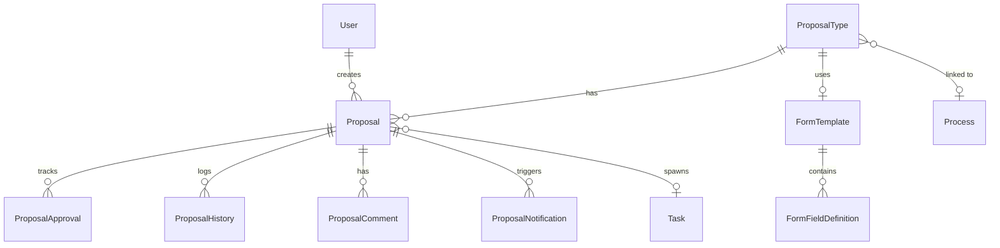

# Kế hoạch phát triển Module Đề xuất / Đề nghị (Proposal / Request System)

> **Nhánh Git:** `Feature/Request`  
> **Tài liệu đặc tả:** [Request.md](file:///d:/Java%20lean/TestCase/Docs/Request.md)  
> **Công nghệ:** Node.js (Express + TypeScript), PostgreSQL (Prisma ORM), React.js (TypeScript + Tailwind CSS), Tích hợp Workflow Engine hiện có.

---

## 1. Tổng quan hệ thống
Module **Đề xuất / Đề nghị (Proposal / Request System)** cung cấp giải pháp toàn diện cho phép:
1. **Quản lý Loại đề xuất (Proposal Types):** Thiết lập các loại đề xuất (nghỉ phép, mua sắm, thanh toán, công tác...) với cơ chế cấu hình linh hoạt về người duyệt, quyền người tạo, thời hạn và liên kết quy trình.
2. **Form mẫu động (Dynamic Form Templates):** Hỗ trợ form mặc định hoặc form tùy biến với đầy đủ các loại Custom Fields (kế thừa và tích hợp cùng hệ thống Custom Fields của module Workflow).
3. **3 Chế độ quy trình duyệt (Approval Workflows):**
   - **PARALLEL:** Duyệt đồng thời (tất cả người duyệt nhận cùng lúc, tất cả phải đồng ý).
   - **SEQUENTIAL:** Duyệt tuần tự theo thứ tự (người sau chỉ nhận khi người trước phê duyệt thành công).
   - **ANY_ONE:** Duyệt nhanh (chỉ cần 1 người duyệt bất kỳ chấp thuận hoặc từ chối).
4. **Cơ chế chọn người duyệt đa dạng:** Người duyệt mặc định cố định + Người duyệt tùy chọn (theo role/phòng ban) + Quản lý trực tiếp (`direct_manager_id`).
5. **Liên kết chặt chẽ với Workflow Engine:** Tự động tạo Task trong Process khi đề xuất được `APPROVED`, ánh xạ `form_data` sang `custom_fields` của Task.
6. **Nhật ký, Lịch sử, Bình luận & Nhắc nhở:** Lưu vết audit log đầy đủ (`ProposalHistories`), quản lý ý kiến phê duyệt (`ProposalApprovals`), thảo luận (`ProposalComments`), và cảnh báo hạn chót/nhắc nhở tự động (`ProposalNotifications` + Cron job).
7. **Báo cáo & Thống kê:** Báo cáo tổng quan theo loại, trạng thái, người duyệt, thời gian phê duyệt trung bình.

---

## 2. Thiết kế Cơ sở Dữ liệu (Database Schema - Prisma)

Cập nhật file `server/prisma/schema.prisma` với các bảng và enum mới:

### 2.1. Các Enums mới
- `ProposalStatus`: `DRAFT`, `PENDING`, `IN_REVIEW`, `APPROVED`, `REJECTED`, `CANCELLED`, `EXPIRED`
- `ApprovalWorkflowType`: `PARALLEL`, `SEQUENTIAL`, `ANY_ONE`
- `ApprovalAction`: `PENDING`, `APPROVED`, `REJECTED`, `SKIPPED`, `CANCELLED`
- `ProposalPriority`: `LOW`, `NORMAL`, `HIGH`, `URGENT`
- `ProposalHistoryType`: `CREATED`, `SUBMITTED`, `UPDATED`, `APPROVED`, `REJECTED`, `CANCELLED`, `APPROVER_ADDED`, `APPROVER_REMOVED`, `WORKFLOW_STARTED`
- `ProposalNotificationType`: `SUBMITTED`, `APPROVED`, `REJECTED`, `REMINDER`, `COMMENT`, `WORKFLOW_STARTED`

### 2.2. Bổ sung trường cho `User`
- `department`: `String?` (Phòng ban của nhân sự, phục vụ lọc phân quyền và chọn người duyệt)
- `managerId`: `String?` (Quản lý trực tiếp của user)
- `manager`: Quan hệ self-relation `User` -> `manager`

### 2.3. Các bảng dữ liệu mới



1. **`ProposalType` (`proposal_types`):**
   - `id`, `name`, `code` (unique), `description`, `icon`, `color`
   - `defaultApproverIds` (`Json` - mảng UUID người duyệt mặc định)
   - `isOptionalApprover` (`Boolean`), `optionalApproverConfig` (`Json?`)
   - `approvalWorkflow` (`ApprovalWorkflowType` - default `PARALLEL`)
   - `deadlineHours` (`Int` - default 0)
   - `creatorIds` (`Json?`), `creatorRoles` (`Json?`), `creatorDepartments` (`Json?`)
   - `useCustomForm` (`Boolean` - default false), `formTemplateId` (`String?` FK -> `form_templates`)
   - `linkedProcessId` (`String?` FK -> `processes`), `autoStartWorkflow` (`Boolean` - default false)
   - `isActive`, `allowDraft`, `allowCancel`, `allowEditAfterSubmit`
   - Audit: `createdById`, `createdAt`, `updatedById`, `updatedAt`, `deletedAt`, `deletedById`

2. **`FormTemplate` (`form_templates`):**
   - `id`, `name`, `description`
   - `proposalTypeId` (`String?` FK -> `proposal_types`)
   - `isDefault` (`Boolean` - default false)
   - `formStructure` (`Json` - cấu trúc sections và field keys)
   - Audit: `createdById`, `createdAt`, `updatedById`, `updatedAt`

3. **`FormFieldDefinition` (`form_field_definitions`):**
   - `id`, `formTemplateId` (`String` FK -> `form_templates`)
   - `fieldKey` (`String`), `fieldLabel` (`String`), `fieldType` (`String`)
   - `fieldConfig` (`Json`), `isRequired` (`Boolean`), `defaultValue` (`Json?`)
   - `placeholder`, `helpText`, `order`, `isVisible`, `visibilityCondition` (`Json?`), `validationRules` (`Json?`), `sectionId`
   - Audit: `createdById`, `createdAt`, `updatedById`, `updatedAt`

4. **`Proposal` (`proposals`):**
   - `id`, `proposalTypeId` (`String` FK -> `proposal_types`), `title`, `content` (`Text?`)
   - `creatorId` (`String` FK -> `users`)
   - `formData` (`Json?` - lưu giá trị custom fields của form)
   - `defaultApprovers` (`Json` - mảng UUID approvers gốc)
   - `optionalApprovers` (`Json` - mảng UUID approvers bổ sung)
   - `directManagerId` (`String?` FK -> `users`)
   - `approvalList` (`Json` - snapshot trạng thái duyệt hiện thời)
   - `status` (`ProposalStatus` - default `DRAFT`)
   - `priority` (`ProposalPriority` - default `NORMAL`)
   - `deadline` (`DateTime?`), `submittedAt`, `approvedAt`, `rejectedAt`, `completedAt`
   - `linkedTaskId` (`String?` FK -> `tasks` - task sinh ra sau khi duyệt)
   - `attachments` (`Json?`), `tags` (`Json?`)
   - Audit: `createdById`, `createdAt`, `updatedById`, `updatedAt`

5. **`ProposalApproval` (`proposal_approvals`):**
   - `id`, `proposalId` (`String` FK -> `proposals`), `approverId` (`String` FK -> `users`)
   - `order` (`Int`), `action` (`ApprovalAction` - default `PENDING`)
   - `comment` (`Text?`), `attachments` (`Json?`), `decidedAt` (`DateTime?`)
   - `reminderSentAt` (`DateTime?`), `reminderCount` (`Int` - default 0)
   - Audit: `createdAt`, `createdById`

6. **`ProposalHistory` (`proposal_histories`):**
   - `id`, `proposalId` (`String` FK -> `proposals`), `version` (`Int`)
   - `changedById` (`String` FK -> `users`), `changeType` (`ProposalHistoryType`)
   - `changeDescription` (`String`), `snapshot` (`Json?`)
   - Audit: `createdAt`, `createdById`

7. **`ProposalComment` (`proposal_comments`):**
   - `id`, `proposalId` (`String` FK -> `proposals`), `userId` (`String` FK -> `users`)
   - `content` (`Text`), `attachments` (`Json?`)
   - Audit: `createdAt`, `createdById`, `updatedAt`, `updatedById`

8. **`ProposalNotification` (`proposal_notifications`):**
   - `id`, `proposalId` (`String` FK -> `proposals`), `recipientId` (`String` FK -> `users`)
   - `type` (`ProposalNotificationType`), `title` (`String`), `content` (`String`)
   - `isRead` (`Boolean` - default false), `readAt` (`DateTime?`)
   - Audit: `createdAt`

---

## 3. Kiến trúc Backend & Logic Nghiệp vụ

### 3.1. Các Controllers & Routes mới (`server/src/`)
1. **`proposalTypeController.ts` & `proposalTypeRoutes.ts`:**
   - `GET /api/proposal-types`: Danh sách loại đề xuất (kèm lọc theo role/department của user đang đăng nhập).
   - `POST /api/proposal-types`: Tạo loại đề xuất mới.
   - `GET /api/proposal-types/:id`: Chi tiết loại đề xuất kèm form template.
   - `PUT /api/proposal-types/:id`: Cập nhật cấu hình loại đề xuất.
   - `DELETE /api/proposal-types/:id`: Soft delete loại đề xuất.
   - `POST /api/proposal-types/:id/toggle-active`: Bật/tắt trạng thái hoạt động.

2. **`formTemplateController.ts` & `formTemplateRoutes.ts`:**
   - CRUD Form Templates: Tạo, sửa, xóa, nhân bản (`duplicate`).
   - Quản lý Fields: Thêm trường mới, sửa cấu hình, sắp xếp thứ tự (`reorder`), xóa trường.

3. **`proposalController.ts` & `proposalRoutes.ts`:**
   - `POST /api/proposals`: Tạo đề xuất (Lưu nháp `DRAFT` hoặc Gửi duyệt `PENDING`).
   - `GET /api/proposals`: Lấy danh sách đề xuất (hỗ trợ filter: trạng thái, loại, người tạo, ngày tháng, tìm kiếm).
   - `GET /api/proposals/:id`: Chi tiết đề xuất (kèm thông tin loại, form data, danh sách approvers, lịch sử duyệt).
   - `PUT /api/proposals/:id`: Cập nhật nội dung (chỉ cho phép khi ở trạng thái `DRAFT` hoặc khi loại đề xuất bật `allow_edit_after_submit`).
   - `DELETE /api/proposals/:id`: Xóa đề xuất nháp.
   - `POST /api/proposals/:id/submit`: Chuyển từ `DRAFT` sang `PENDING` và khởi tạo quy trình duyệt.
   - `POST /api/proposals/:id/cancel`: Hủy đề xuất (trước khi duyệt xong).
   - `POST /api/proposals/:id/approve`: Người duyệt phê duyệt đề xuất (kèm nhận xét, file minh chứng).
   - `POST /api/proposals/:id/reject`: Người duyệt từ chối đề xuất (bắt buộc nhận xét lý do).
   - `POST /api/proposals/:id/start-workflow`: Kích hoạt quy trình Workflow thủ công nếu chưa auto-start.
   - `GET /api/proposals/:id/history`: Lấy dòng thời gian lịch sử đề xuất.
   - `GET /api/proposals/:id/comments` & `POST /api/proposals/:id/comments`: Thảo luận trao đổi.

4. **`myProposalController.ts` (Sub-routes cho User Dashboard):**
   - `GET /api/my/proposals`: Đề xuất do tôi tạo.
   - `GET /api/my/approvals`: Đề xuất đang chờ tôi phê duyệt.
   - `GET /api/my/approved`: Đề xuất tôi đã chấp thuận.
   - `GET /api/my/rejected`: Đề xuất tôi đã từ chối.

5. **`proposalReportController.ts` & `proposalReportRoutes.ts`:**
   - Thống kê tỷ lệ đề xuất theo loại, trạng thái, thời gian xử lý trung bình, số lượng quá hạn.

### 3.2. Core Service: `ProposalWorkflowEngine` (`server/src/services/proposalWorkflowService.ts`)
- **Khởi tạo danh sách duyệt (`initializeApprovals`):**
  - Tập hợp approvers từ `default_approver_ids` + `optional_approvers` + `direct_manager_id`.
  - Thiết lập danh sách `ProposalApproval` tương ứng với workflow:
    - Nếu `PARALLEL`: Tất cả đều nhận action `PENDING`, gửi thông báo đến tất cả.
    - Nếu `SEQUENTIAL`: Sắp xếp theo order; chỉ người đầu tiên nhận `PENDING` (và nhận thông báo), những người sau ở trạng thái chờ kích hoạt.
    - Nếu `ANY_ONE`: Tất cả đều nhận action `PENDING` và nhận thông báo.
- **Xử lý Quyết định Duyệt (`processDecision`):**
  - Ghi nhận `APPROVED` hoặc `REJECTED` cho `approverId`.
  - Kiểm tra điều kiện hoàn tất quy trình:
    - **PARALLEL:** Nếu có 1 người `REJECTED` -> Đề xuất chuyển thành `REJECTED`, dừng các lượt còn lại. Nếu tất cả đều `APPROVED` -> Đề xuất chuyển thành `APPROVED`.
    - **SEQUENTIAL:** Nếu người hiện tại `REJECTED` -> Đề xuất chuyển thành `REJECTED`. Nếu `APPROVED` -> chuyển lượt sang người kế tiếp (đặt trạng thái `PENDING` và gửi thông báo). Nếu là người cuối cùng -> Đề xuất chuyển thành `APPROVED`.
    - **ANY_ONE:** Ngay khi 1 người `APPROVED` -> Đề xuất chuyển thành `APPROVED`, các approver khác tự động đổi thành `SKIPPED`. Nếu 1 người `REJECTED` -> Đề xuất chuyển thành `REJECTED`, các approver khác chuyển thành `SKIPPED`.
- **Tích hợp sang Workflow (`triggerLinkedWorkflow`):**
  - Khi proposal đạt `APPROVED`, kiểm tra `linkedProcessId`.
  - Nếu `autoStartWorkflow = true`:
    - Tạo `Task` mới trong `Process` được liên kết.
    - Ánh xạ tự động: Các keys trong `formData` của đề xuất tương ứng với `fieldKey` của `CustomFieldDefinition` trong Process sẽ được sao chép vào `custom_fields` của Task.
    - Cập nhật `linkedTaskId` vào Proposal.
    - Ghi nhận lịch sử `WORKFLOW_STARTED`.

### 3.3. Background Scheduler / Cron Job (`server/src/jobs/proposalReminderJob.ts`)
- Định kỳ quét các đề xuất có trạng thái `PENDING` hoặc `IN_REVIEW` có hạn chót (`deadline`):
  - Nếu `now > deadline`: Cập nhật trạng thái đề xuất sang `EXPIRED`, gửi thông báo quá hạn.
  - Kiểm tra mốc nhắc nhở (50%, 75%, 90% thời hạn): Gửi `ProposalNotification` nhắc nhở người duyệt chưa xử lý.

---

## 4. Thiết kế Frontend (`client/src/`)

### 4.1. Cấu trúc Thư mục Module Request/Proposal
```
client/src/
├── types/
│   └── proposal.ts                      # Toàn bộ Types & Interfaces
├── services/
│   └── proposalApi.ts                   # Axios API calls
├── pages/
│   └── Proposals/
│       ├── ProposalHub.tsx              # Trang chính: Tabs (Của tôi, Chờ tôi duyệt, Lịch sử duyệt, Tất cả)
│       ├── ProposalCreate.tsx           # Trang tạo mới / chọn loại đề xuất
│       ├── ProposalDetail.tsx           # Trang xem chi tiết, dòng thời gian duyệt, bình luận, nút hành động
│       ├── ProposalTypesManagement.tsx  # Trang quản lý Loại đề xuất & Form templates (Admin/Manager)
│       ├── ProposalTypeEditModal.tsx    # Modal tạo/sửa loại đề xuất & cấu hình workflow
│       └── ProposalReports.tsx          # Báo cáo thống kê trực quan
└── components/
    └── Proposals/
        ├── ProposalTypeCard.tsx         # Card chọn loại đề xuất trực quan
        ├── ApprovalTimeline.tsx         # Dòng thời gian hiển thị tiến trình duyệt (visual steps)
        ├── ApprovalActionModal.tsx      # Modal xác nhận Phê duyệt / Từ chối kèm nhận xét & file
        ├── ProposalStatusBadge.tsx      # Badge hiển thị trạng thái chuẩn UX
        ├── DynamicProposalForm.tsx      # Renderer form đề xuất (tái sử dụng DynamicFieldRenderer)
        └── ProposalCommentsSection.tsx  # Khu vực thảo luận trao đổi
```

### 4.2. Trải nghiệm Người dùng (UX Flows)
1. **Duyệt & Quản lý (Proposal Hub):**
   - Bộ thẻ tóm tắt nhanh (KPI Cards): Số đề xuất cần xử lý, Đang chờ, Đã duyệt, Đã từ chối, Quá hạn.
   - Tab chuyển đổi mượt mà giữa: **Đề xuất cần tôi duyệt**, **Đề xuất tôi đã gửi**, **Đã xử lý**, **Quản lý danh sách (Admin)**.
2. **Quy trình Tạo đề xuất trực quan:**
   - Bước 1: Duyệt danh mục loại đề xuất (hiển thị dạng lưới thẻ đẹp mắt kèm Icon, Màu sắc, Thời hạn xử lý, Kiểu duyệt).
   - Bước 2: Hiển thị form mẫu động với validation rõ ràng.
   - Bước 3: Phần chọn người duyệt tùy chọn (nếu loại đề xuất cho phép) có bộ lọc nhân viên theo phòng ban hoặc chọn nhanh "Quản lý trực tiếp".
   - Bước 4: Tùy chọn "Lưu nháp" hoặc "Gửi duyệt ngay".
3. **Màn hình Chi tiết & Phê duyệt:**
   - Khung thông tin đề xuất: Dữ liệu form đã điền, file đính kèm.
   - **Approval Step Tracker:** Hiển thị trực quan từng bước duyệt (Ai đã duyệt, ngày giờ, nhận xét, ai đang chờ duyệt, ai đã bị bỏ qua).
   - Nút hành động nổi bật: `Phê duyệt` (màu xanh lá) và `Từ chối` (màu đỏ) mở modal nhập ý kiến; nút `Hủy đề xuất` cho người tạo; nút `Khởi chạy quy trình` khi cần tạo Task sang Workflow.
   - Tab trao đổi / bình luận tương tác thời gian thực.
4. **Tích hợp Navigation:**
   - Bổ sung menu **Đề xuất & Duyệt** (`/proposals`) trên `Navbar.tsx` với badge đếm số lượng đề xuất đang chờ người dùng phê duyệt.

---

## 5. Kế hoạch triển khai chi tiết theo từng bước (Phased Implementation Plan)

### Bước 1: Cơ sở Dữ liệu & Prisma Migration (✅ Hoàn thành)
- Thêm các Enum và Model mới vào `server/prisma/schema.prisma`.
- Cập nhật model `User` (thêm `department`, `managerId`).
- Chạy `npx prisma db push` (hoặc migrate) và sinh Prisma Client (`npx prisma generate`).

### Bước 2: Backend Core Services & Workflow Engine (✅ Hoàn thành)
- Tạo `proposalWorkflowService.ts`: Triển khai logic tính toán người duyệt, phân luồng `PARALLEL`, `SEQUENTIAL`, `ANY_ONE`, kiểm tra điều kiện hoàn thành đề xuất.
- Triển khai logic tự động ánh xạ dữ liệu sang `Task` của module Workflow khi đề xuất đạt `APPROVED`.

### Bước 3: Backend Controllers, Routes & Validation (✅ Hoàn thành)
- Viết `proposalTypeController.ts` & `proposalTypeRoutes.ts`.
- Viết `formTemplateController.ts` & `formTemplateRoutes.ts`.
- Viết `proposalController.ts` & `proposalRoutes.ts`.
- Viết `proposalReportController.ts` & `proposalReportRoutes.ts`.
- Đăng ký các routes mới vào `server/src/index.ts`.

### Bước 4: Backend Notification & Scheduler (✅ Hoàn thành)
- Viết `proposalNotificationService.ts`: Ghi nhận thông báo trong hệ thống khi có đề xuất mới cần duyệt, khi có quyết định duyệt/từ chối, khi quá hạn.
- Viết cron service kiểm tra hạn chót (deadline) và cập nhật `EXPIRED` / gửi nhắc nhở.

### Bước 5: Frontend API & Types Setup (✅ Hoàn thành)
- Định nghĩa interfaces trong `client/src/types/proposal.ts`: Đầy đủ types cho Proposal, ProposalType, FormTemplate, FormFieldDefinition, Approval, Comment, Notification, Report, DTOs và UI configs (Status, Priority, WorkflowType, Action labels & styles).
- Cập nhật `client/src/types/index.ts`: Bổ sung `department`, `managerId`, `manager` cho `User` và `export * from './proposal'`.
- Viết API client trong `client/src/services/proposalApi.ts`: Gồm `proposalTypeApi`, `formTemplateApi`, `proposalApi`, `myProposalApi`, `proposalReportApi`, `proposalNotificationApi`, `proposalUploadApi` và `proposalServices`.
- Đã xác thực biên dịch `tsc` và đóng gói Vite `npm run build` thành công 100%.

### Bước 6: Frontend - Quản lý Loại đề xuất & Form Templates (✅ Hoàn thành)
- Xây dựng giao diện cấu hình `ProposalTypesManagement.tsx`: Hỗ trợ quản lý danh mục loại đề xuất (thẻ trực quan, icon, mã code, kiểu duyệt, thời hạn, liên kết quy trình, toggle kích hoạt) và tab quản lý Form mẫu động (`Form Templates`).
- Xây dựng modal tạo/sửa loại đề xuất `ProposalTypeEditModal.tsx`: Chia 4 tab chuyên nghiệp (Thông tin chung, Luồng phê duyệt, Form mẫu & Liên kết Quy trình, Cài đặt nâng cao) với icon picker, color picker, multi-select người duyệt có thứ tự cấp duyệt, cấu hình người duyệt tùy chọn, liên kết process workflow tự động tạo Task khi duyệt.
- Xây dựng modal quản lý Form mẫu `FormTemplateEditModal.tsx`: Hỗ trợ tạo/sửa form mẫu, thêm/sửa/xóa/sắp xếp thứ tự các trường dữ liệu động với nhiều kiểu trường (văn bản, số, ngày tháng, chọn 1/nhiều, radio, file, nhân sự...), cấu hình options và bắt buộc nhập.
- Tích hợp routing `/proposals/types` và `/proposals/settings` trong `client/src/App.tsx`.
- Đã xác thực biên dịch `tsc -b` và đóng gói Vite `npm run build` thành công 100%.

### Bước 7: Frontend - Tạo Đề xuất & Renderer Form Động (✅ Hoàn thành)
- Xây dựng component `DynamicProposalForm.tsx`: Tích hợp linh hoạt với `DynamicFieldRenderer`, tự động chuyển đổi `FormFieldDefinition`, hiển thị validation errors, chia sections trực quan hoặc 2 cột responsive, hỗ trợ cả chế độ readOnly.
- Xây dựng trang `ProposalCreate.tsx`: Quy trình Wizard 4 bước mượt mà:
  - **Bước 1 (Chọn loại):** Lưới thẻ loại đề xuất trực quan kèm icon, màu sắc, thời hạn, kiểu duyệt; hỗ trợ tìm kiếm nhanh và tự động chọn qua query param `?typeId=...`.
  - **Bước 2 (Nhập thông tin):** Tiêu đề, mức độ ưu tiên (Thấp, Bình thường, Cao, Khẩn cấp), render Form động qua `DynamicProposalForm` hoặc nội dung tự do, tệp đính kèm (`attachments`), thẻ phân loại (`tags`).
  - **Bước 3 (Người duyệt):** Danh sách người duyệt cố định kèm thứ tự cấp duyệt, phần bổ sung người duyệt tùy chọn với nút chọn nhanh "Quản lý trực tiếp" của người dùng.
  - **Bước 4 (Xem lại & Gửi):** Thẻ tổng quan xem trước dữ liệu form, tiến trình duyệt trực quan (`Lộ trình phê duyệt dự kiến`), nút "Lưu bản nháp" (`DRAFT`) hoặc "Gửi phê duyệt ngay" (`PENDING`).
- Bổ sung endpoint backend `GET /api/users/directory` cho phép người dùng đã xác thực tra cứu danh bạ để chọn người duyệt.
- Tích hợp routing `/proposals/new` và `/proposals/create` trong `client/src/App.tsx`.
- Đã xác thực biên dịch `tsc -b` và đóng gói Vite `npm run build` thành công 100%.

### Bước 8: Frontend - Proposal Hub, Chi tiết & Thao tác Duyệt (✅ Hoàn thành)
- Xây dựng trung tâm điều hành `ProposalHub.tsx`:
  - 4 thẻ KPI động đếm số lượng đề xuất theo vai trò: "Chờ tôi phê duyệt", "Đề xuất tôi đã gửi", "Tôi đã chấp thuận", "Tôi đã từ chối".
  - Bộ tabs lọc nhanh (`PENDING_ME`, `MY_PROPOSALS`, `MY_APPROVED`, `ALL`).
  - Thanh tìm kiếm từ khóa, bộ lọc theo Loại đề xuất, Mức độ ưu tiên, Trạng thái và Phân trang.
  - Bảng danh sách đề xuất hiển thị trực quan (màu loại đề xuất, icon, trạng thái, người tạo, hạn chót, nút thao tác nhanh Duyệt/Từ chối cho mục chờ duyệt).
- Xây dựng trang chi tiết `ProposalDetail.tsx`:
  - Banner tiêu đề đề xuất kèm mã loại đề xuất, icon, trạng thái, mức độ ưu tiên, người tạo và ngày tạo.
  - Thanh công cụ hành động: "Gửi duyệt ngay" / "Xóa nháp" (cho Creator khi là DRAFT), "Phê duyệt" / "Từ chối" (cho Approver), "Hủy đề xuất" (khi PENDING/IN_REVIEW), "Khởi chạy quy trình" / "Xem nhiệm vụ quy trình" (khi APPROVED có liên kết Workflow Process).
  - Tích hợp `DynamicProposalForm` ở chế độ `readOnly` để xem lại toàn bộ dữ liệu form động đã nhập.
  - Phần tệp đính kèm (`attachments`) hỗ trợ tải xuống (`Download`) và xem trực tiếp.
  - Tabs bình luận trao đổi (`ProposalCommentsSection`) và nhật ký lịch sử thay đổi (`histories`).
  - Cột tiến trình phê duyệt trực quan (`ApprovalTimeline`), thẻ thông tin người đề xuất, thời hạn quy định và thông tin liên kết Task/Process.
- Xây dựng modal thao tác phê duyệt đa năng `ApprovalActionModal.tsx`:
  - Hỗ trợ nhập ý kiến / lý do chấp thuận hoặc bắt buộc nhập lý do khi từ chối.
  - Đính kèm tệp phản hồi trực tiếp khi duyệt/từ chối.
- Xây dựng khu vực bình luận tương tác `ProposalCommentsSection.tsx`:
  - Luồng tin nhắn 2 chiều giữa người tạo và cấp duyệt, avatar, thời gian, bong bóng tin nhắn và đính kèm tệp trong comment.
- Đã xác thực biên dịch TypeScript cả Server (`npx tsc --noEmit`) và Client (`tsc -b && vite build`) thành công 100%.

### Bước 9: Báo cáo Thống kê & Hoàn thiện Navigation (✅ Hoàn thành)
- Xây dựng trang Báo cáo & Phân tích chuyên sâu `ProposalReports.tsx`:
  - Bộ lọc linh hoạt: Presets thời gian nhanh (Hôm nay, 7 ngày, 30 ngày, Tháng này, Tất cả), chọn khoảng ngày tùy chỉnh từ ngày đến ngày, và lọc theo Loại đề xuất (`ProposalType`).
  - 4 thẻ KPI điều hành: Tổng số đề xuất, Tỷ lệ chấp thuận (`Approval Rate %`), Thời gian xử lý trung bình (`Avg Response Hours` kèm min/max), và Số lượng đề xuất đang quá hạn (`Overdue Proposals`).
  - Biểu đồ phân bố theo trạng thái (Stacked status bar + bảng chi tiết số lượng & tỷ lệ %).
  - Biểu đồ cơ cấu theo loại đề xuất (Progress bar màu sắc trực quan, mã loại đề xuất, tỷ lệ %).
  - Tabs chi tiết:
    - Bảng xếp hạng hiệu suất người duyệt (`Approver Leaderboard`): Tổng lượt phân công, Đã chấp thuận, Đã từ chối, Còn chờ xử lý, Thời gian phản hồi trung bình.
    - Danh sách đề xuất quá hạn (`Overdue Alert Table`): Cảnh báo deadline, người tạo, liên kết xử lý trực tiếp.
  - Hỗ trợ in báo cáo (`window.print()`) và làm mới dữ liệu nhanh.
- Hoàn thiện điều hướng & Thông báo trên `Navbar.tsx`:
  - Bổ sung link trực tiếp tới **Đề xuất** (`/proposals`) và **Báo cáo** (`/proposals/reports`).
  - Hiển thị badge số lượng đề xuất đang chờ người dùng hiện tại phê duyệt (`pendingApprovalsCount`) với hiệu ứng pulse nổi bật.
  - Tích hợp chuông thông báo (`Bell`) kèm bộ đếm thông báo chưa đọc (`unreadNotifCount`).
  - Dropdown danh sách thông báo đề xuất gần nhất: Phân biệt trạng thái đã đọc/chưa đọc, hiển thị tiêu đề, nội dung tóm tắt, thời gian, hỗ trợ click chuyển thẳng tới chi tiết đề xuất (`/proposals/:id`), và nút "Đọc tất cả".
  - Tự động thăm dò (polling) cập nhật số lượng thông báo và việc cần duyệt định kỳ.
- Đăng ký routing `/proposals/reports` trong `client/src/App.tsx`.
- Đã xác thực biên dịch TypeScript cả Server (`npx tsc --noEmit`) và Client (`tsc -b && vite build`) thành công 100%.

---

## 6. Kế hoạch Kiểm thử & Xác minh (Verification Plan)

### 6.1. Kiểm thử Tự động & Build Check
- **Server Compilation:** `npx tsc --noEmit` trong thư mục `server` đảm bảo không có lỗi type.
- **Client Compilation:** `npx tsc -b` trong thư mục `client` đảm bảo không có lỗi type.
- **Client Build:** `npm run build` trong thư mục `client` kiểm tra bundling thành công.

### 6.2. Kiểm thử Kịch bản Nghiệp vụ (End-to-End Scenarios)
1. **Kịch bản 1 (Tạo loại đề xuất & Form mẫu):**
   - Tạo loại "Đề xuất nghỉ phép" với form gồm các trường: Loại phép (select), Ngày bắt đầu (date), Ngày kết thúc (date), Lý do (textarea).
   - Chọn kiểu duyệt `SEQUENTIAL` với 2 cấp duyệt (Manager -> HR).
2. **Kịch bản 2 (Lưu nháp và Gửi duyệt):**
   - User tạo đề xuất nghỉ phép, lưu nháp `DRAFT`, sau đó chỉnh sửa và nhấn `Gửi duyệt` -> chuyển trạng thái sang `PENDING`.
3. **Kịch bản 3 (Duyệt tuần tự SEQUENTIAL):**
   - Người duyệt 1 nhận thông báo, mở chi tiết và bấm "Phê duyệt" -> Người duyệt 2 nhận được lượt duyệt.
   - Người duyệt 2 bấm "Phê duyệt" -> Đề xuất chuyển trạng thái `APPROVED`.
4. **Kịch bản 4 (Duyệt song song PARALLEL & Từ chối):**
   - Tạo đề xuất duyệt song song 2 người. Một người bấm "Từ chối" kèm lý do -> Đề xuất lập tức chuyển sang `REJECTED`.
5. **Kịch bản 5 (Liên kết Workflow):**
   - Tạo loại "Đề xuất mua sắm" liên kết với Process Workflow và bật `autoStartWorkflow = true`.
   - Khi đề xuất được duyệt đầy đủ -> Xác minh một Task mới được tạo trong Workflow Process với dữ liệu form được copy đầy đủ.
6. **Kịch bản 6 (Bình luận & Audit Log):**
   - Thêm bình luận trao đổi trên đề xuất; kiểm tra tab lịch sử xem các sự kiện có được ghi nhận đầy đủ với snapshot hay không.
