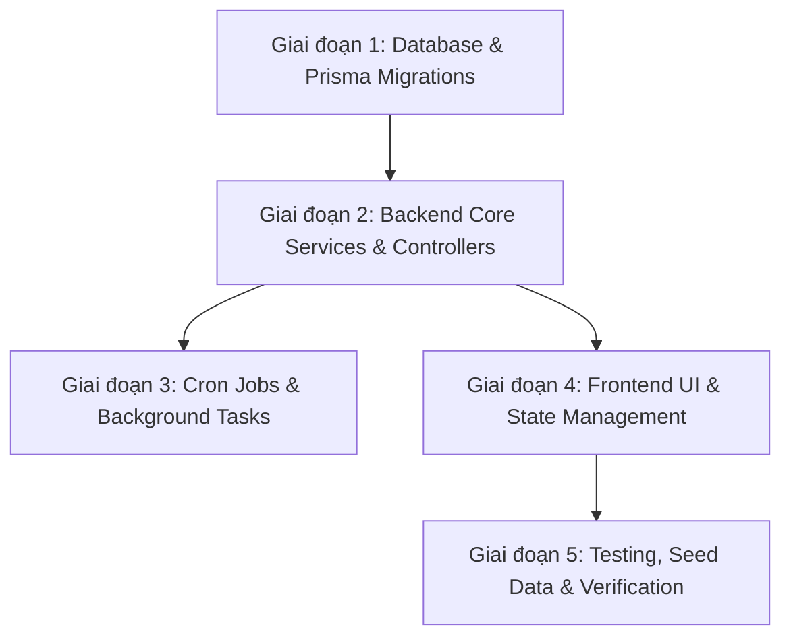

# Kế hoạch triển khai: Hệ thống Quản lý Quy trình và Nhiệm vụ (Workflow & Task Management System)

Dựa trên tài liệu thiết kế [deepseek_markdown_workflow.md](file:///d:/Java%20lean/TestCase/Docs/deepseek_markdown_workflow.md) và các yêu cầu tùy biến:
- **Database & Migration:** Quản lý cấu trúc schema 100% bằng **Prisma Migrations** chính quy (`prisma/migrations/`).
- **File Upload:** Tái sử dụng hệ thống **`storageService`** & **`StorageProvider`** sẵn có của dự án (hỗ trợ lưu trữ file an toàn, quản lý cấu hình dung lượng và định dạng).
- **Phân quyền & Tích hợp:** Tích hợp với hệ thống User, Auth JWT và RBAC hiện tại.

---

## User Review Required

> [!NOTE]
> - **Prisma Migrations:** Tất cả thay đổi schema sẽ được tạo thông qua `npx prisma migrate dev --name add_workflow_and_task_management` để đảm bảo file SQL migration được theo dõi chuẩn mực trong git và môi trường production/deploy.
> - **Tái sử dụng Storage Service:** Sẽ mở rộng `storageService` hiện tại (`services/storageService.ts`) để lưu trữ file cho Task / Todo / Comments, đảm bảo thống nhất cấu hình thư mục lưu trữ (Local / S3) và đồng bộ với hệ thống.

---

## Kiến trúc & Các giai đoạn triển khai (Phased Implementation)



---

## Giai đoạn 1: Database & Prisma Migrations

### 1. Cập nhật Model trong [schema.prisma](file:///d:/Java%20lean/TestCase/server/prisma/schema.prisma)
Bổ sung các bảng và quan hệ:
- **`Role` Enum**: Mở rộng bổ sung `MANAGER`, `USER`.
- **`TaskStatus` Enum**: `'PENDING' | 'IN_PROGRESS' | 'COMPLETED' | 'OVERDUE' | 'CANCELLED'`.
- **`TaskHistoryChangeType` Enum**: `'CREATED' | 'UPDATED' | 'STEP_CHANGED' | 'COMPLETED' | 'CANCELLED'`.
- **`Process` (`processes`)**:
  - `id`, `name`, `description`, `managerId` (FK -> `User`), `watcherIds` (JSON), `createdAt`, `createdById` (FK -> `User`), `updatedAt`, `updatedById` (FK -> `User`), `deletedAt`, `deletedById` (FK -> `User`).
- **`ProcessStep` (`process_steps`)**:
  - `id`, `processId` (FK -> `Process`), `name`, `executorIds` (JSON), `timeLimitHours` (Int), `order` (Int), `instructions` (Text), `createdAt`, `createdById`, `updatedAt`, `updatedById`.
- **`Task` (`tasks`)**:
  - `id`, `processId` (FK -> `Process`), `name`, `content` (Text), `customFields` (JSON), `currentStepId` (FK -> `ProcessStep`), `executorIds` (JSON), `watcherIds` (JSON), `previousExecutorId` (nullable), `startedAt`, `deadline`, `completedAt`, `status`, `fileUploads` (JSON), `createdAt`, `createdById`, `updatedAt`, `updatedById`.
- **`Todo` (`todos`)**:
  - `id`, `taskId` (FK -> `Task`), `description`, `executorId` (FK -> `User`), `deadline`, `watcherIds` (JSON), `files` (JSON), `isCompleted` (Boolean), `completedAt`, `createdAt`, `createdById`, `updatedAt`, `updatedById`.
- **`TaskComment` (`task_comments`)**:
  - `id`, `taskId` (FK -> `Task`), `userId` (FK -> `User`), `content`, `files` (JSON), `createdAt`, `createdById`, `updatedAt`, `updatedById`.
- **`TaskHistory` (`task_histories`)**:
  - `id`, `taskId` (FK -> `Task`), `version` (Int), `changedById` (FK -> `User`), `changeType`, `changeDescription`, `snapshot` (JSON), `createdAt`, `createdById`.

### 2. Thực thi Prisma Migration
- Tạo migration chuẩn:
  ```bash
  npx prisma migrate dev --name add_workflow_and_task_management
  ```
- Kiểm tra migration log và generate Prisma client.

---

## Giai đoạn 2: Backend API & Business Logic (`server/src`)

### 1. Tích hợp Storage & Middlewares
- **Tái sử dụng Storage Service**: Tận dụng `getStorageConfig()` và `createStorageProvider()` trong [storageService.ts](file:///d:/Java%20lean/TestCase/server/src/services/storageService.ts) để quản lý tải file đính kèm cho Task, Todo, Comment.
- **`authMiddleware` & `rbacMiddleware`**: Tích hợp với token authentication hiện tại, bổ sung permission checks cho Process & Task.

### 2. Services & Controllers
- **`ProcessController` & `ProcessService`**:
  - CRUD Process (hỗ trợ soft delete `deletedAt`, `deletedById`).
  - Quản lý các bước `ProcessStep` (Thêm, sửa, xóa, sắp xếp thứ tự `order`).
- **`TaskController` & `TaskService`**:
  - `POST /api/tasks`: Tạo nhiệm vụ từ Process -> Gán `currentStepId` = Step 1, gán `executorIds` từ Step 1, tính `deadline = now + timeLimitHours`, `status = IN_PROGRESS`, tự động tạo **`TaskHistory` version 1 (Snapshot)**.
  - `POST /api/tasks/:id/transition`: Chuyển sang bước kế tiếp (tìm step có `order + 1`), cập nhật `currentStepId`, `executorIds`, `previousExecutorId`, tính lại `deadline`, tạo snapshot mới `version N+1`. Nếu là step cuối cùng -> hoàn thành task (`COMPLETED`).
  - `POST /api/tasks/:id/complete` & `/cancel`: Cập nhật trạng thái và tạo snapshot history.
  - `GET /api/tasks/:id/history` & `/history/:version`: Xem lịch sử và snapshot tại từng version.
- **`TodoController` & `TodoService`**:
  - CRUD Todo, `PUT /api/todos/:id/toggle` đánh dấu hoàn thành.
- **`CommentController` & `CommentService`**:
  - Thêm, sửa, xóa bình luận kèm file đính kèm qua storage provider.
- **`WorkflowUploadController`**:
  - API upload file cho workflow (`/api/workflow/upload`).
- **`ReportController` & `ReportService`**:
  - Thống kê tasks theo status (`/api/reports/tasks-by-status`).
  - Thống kê tasks theo quy trình (`/api/reports/tasks-by-process`).
  - Thống kê tasks theo người thực thi (`/api/reports/tasks-by-executor`).
  - Danh sách task quá hạn (`/api/reports/overdue-tasks`).

---

## Giai đoạn 3: Cron Jobs

- Thiết lập job kiểm tra định kỳ bằng `node-cron`:
  - Quét các Task có `status = IN_PROGRESS` và `deadline < now()`.
  - Cập nhật trạng thái `OVERDUE`.
  - Ghi nhận lịch sử cập nhật hệ thống.

---

## Giai đoạn 4: Frontend Development (`client/src`)

### 1. Navigation & Routing
- Thêm menu **Quy trình & Nhiệm vụ** trên thanh điều hướng.
- `/processes`: Quản lý danh sách quy trình.
- `/processes/new` & `/processes/:id/edit`: Trình thiết lập quy trình & các bước tuần tự (Step Builder).
- `/tasks`: Danh sách nhiệm vụ (Bộ lọc nâng cao theo trạng thái, quy trình, người thực thi, hạn xử lý).
- `/tasks/new`: Khởi tạo nhiệm vụ mới từ quy trình.
- `/tasks/:id`: Chi tiết nhiệm vụ:
  - **Stepper / Timeline**: Hiển thị trực quan tiến trình các bước.
  - **Hành động**: Nút "Chuyển bước", "Hoàn thành", "Hủy nhiệm vụ".
  - **Todo Checklist**: Danh sách công việc con.
  - **Comment & Attachments Box**: Bình luận & tải file đính kèm.
  - **History & Snapshot Viewer**: Xem lịch sử thay đổi qua từng version.
- `/workflow-reports`: Báo cáo thống kê trực quan.

---

## Giai đoạn 5: Seed Data & Testing

- Viết kịch bản Seed Data vào `server/prisma/seed.ts` (hoặc `workflowSeed.ts`):
  - 3-5 users (Admin, Manager, User 1, User 2).
  - 2 Quy trình mẫu: Phê duyệt hợp đồng (3 bước) & Xử lý sự cố (3 bước).
  - 5 Nhiệm vụ mẫu (`IN_PROGRESS`, `COMPLETED`, `OVERDUE`) kèm todos, comments và snapshot histories.
- Tạo file kiểm thử API `workflow.http`.

---

## Kế hoạch kiểm thử & Xác thực (Verification Plan)

### Automated & Database:
1. Chạy migration: `npx prisma migrate dev --name add_workflow_and_task_management`.
2. Chạy seed data: `npm run seed`.
3. Kiểm tra tính toàn vẹn khóa ngoại (Foreign keys) và cascade deletes.

### API & Flow Verification:
- Test toàn bộ luồng tạo process -> tạo task -> chuyển bước -> snapshot -> hoàn thành.
- Test upload file qua storage service.
- Test Cron job cập nhật task overdue.
