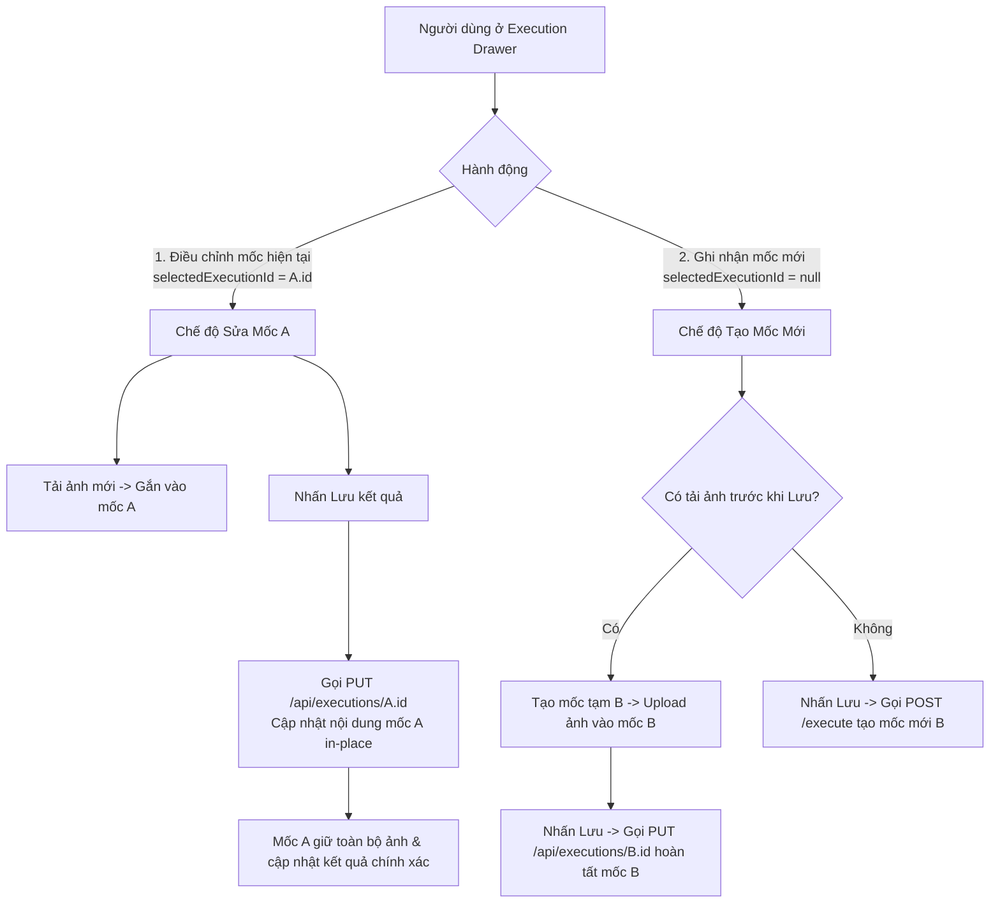

# Kế hoạch khắc phục lỗi: Ảnh minh chứng bị ghi nhận vào mốc trước khi điều chỉnh kết quả

## 1. Phân tích Nguyên nhân Gốc rễ (Root Cause Analysis)

### Hiện tượng:
Khi người dùng đang xem 1 mốc thực thi cũ (ví dụ mốc $A$), nhấn **"Điều chỉnh kết quả"**, thêm ảnh minh chứng mới và nhấn **"Lưu kết quả"**, hình ảnh mới bị gắn vào mốc $A$ (mốc trước) thay vì mốc vừa được lưu (mốc $B$).

### Nguyên nhân kỹ thuật:
1. **Tại `ExecutionDrawer.tsx`**:
   - Khi đang mở xem mốc $A$, state `currentExecutionId` và `selectedExecutionId` giữ giá trị `A.id`.
   - Khi người dùng tải ảnh lên trong chế độ sửa, `ImageUploader` gọi `handleCustomUpload(files)`. Vì `currentExecutionId` đang là `A.id`, ảnh được upload qua API `POST /api/uploads/executions/A.id/images`, tức là ảnh được gắn trực tiếp vào mốc $A$ trong Database (`TestExecutionImage.executionId = A.id`).
   - Khi người dùng nhấn **"Lưu kết quả"** (`handleSave`), hàm luôn gọi `executionApi.executeTestCase(...)` (`POST /api/executions/:testCaseId/execute`).
   - Backend `ExecutionController.executeTestCase` luôn thực thi lệnh `prisma.testExecution.create(...)`, tạo ra một bản ghi mốc hoàn toàn mới $B$ (`B.id`).
   - Mốc $B$ vừa tạo ra trong Database không có bất kỳ ảnh nào liên kết với nó, trong khi mốc cũ $A$ lại chứa các ảnh mới upload.
   - Hệ thống backend hiện tại **chưa có API cập nhật mốc thực thi (`updateExecution`)**, dẫn đến mọi lần nhấn "Lưu kết quả" đều biến thành tạo mốc mới mà không cập nhật mốc đang chọn.

---

## 2. Giải pháp Kỹ thuật Đề xuất

### Luồng xử lý chuẩn hóa:



---

## 3. Chi tiết các thay đổi đề xuất (Proposed Changes)

### 1. Backend: Bổ sung API cập nhật mốc thực thi

#### [MODIFY] [executionController.ts](file:///d:/Java%20lean/TestCase/server/src/controllers/executionController.ts)
- Bổ sung phương thức `updateExecution`:
  ```typescript
  static async updateExecution(req: AuthRequest, res: Response) {
    try {
      const { executionId } = req.params;
      const { server, os, status, actualResult, evaluation, notes } = req.body;
      const userId = req.user?.id;
      const userRole = req.user?.role;

      const existing = await prisma.testExecution.findUnique({
        where: { id: executionId },
      });

      if (!existing) {
        return res.status(404).json({ message: 'Không tìm thấy kết quả thực thi' });
      }

      // Kiểm tra quyền: chỉ tác giả hoặc ADMIN mới được sửa mốc này
      if (existing.executedById && existing.executedById !== userId && userRole !== 'ADMIN') {
        return res.status(403).json({ message: 'Bạn không có quyền chỉnh sửa kết quả của người khác' });
      }

      const validStatuses: TestExecutionStatus[] = ['PASSED', 'FAILED', 'BLOCKED', 'UNTESTED'];
      const executionStatus: TestExecutionStatus = validStatuses.includes(status) ? status : existing.status;

      const updated = await prisma.testExecution.update({
        where: { id: executionId },
        data: {
          server: server !== undefined ? server : existing.server,
          os: os !== undefined ? os : existing.os,
          status: executionStatus,
          actualResult: actualResult !== undefined ? actualResult : existing.actualResult,
          evaluation: evaluation !== undefined ? evaluation : existing.evaluation,
          notes: notes !== undefined ? notes : existing.notes,
          updatedAt: new Date(),
        },
        include: {
          executedBy: {
            select: { id: true, fullName: true, email: true },
          },
          images: {
            orderBy: { uploadedAt: 'asc' },
          },
        },
      });

      return res.json({
        message: 'Cập nhật kết quả kiểm thử thành công',
        execution: updated,
      });
    } catch (error: any) {
      console.error('Update execution error:', error);
      return res.status(500).json({ message: 'Lỗi khi cập nhật kết quả kiểm thử', error: error.message });
    }
  }
  ```

#### [MODIFY] [executionRoutes.ts](file:///d:/Java%20lean/TestCase/server/src/routes/executionRoutes.ts)
- Khai báo route:
  ```typescript
  router.put('/:executionId', authenticate, requirePermission('testcase:execute'), ExecutionController.updateExecution);
  ```

---

### 2. Frontend: API Service & Drawer Controller

#### [MODIFY] [api.ts](file:///d:/Java%20lean/TestCase/client/src/services/api.ts)
- Bổ sung hàm gọi API vào `executionApi`:
  ```typescript
  updateExecution: (
    executionId: string,
    data: {
      server?: string;
      os?: string;
      status: string;
      actualResult?: string;
      evaluation?: string;
      notes?: string;
    }
  ) =>
    api.put<{ message: string; execution: TestExecution }>(
      `/executions/${executionId}`,
      data
    ),
  ```

#### [MODIFY] [ExecutionDrawer.tsx](file:///d:/Java%20lean/TestCase/client/src/components/ExecutionDrawer.tsx)
- Cập nhật logic `handleSave`:
  - **Trường hợp 1 (Sửa mốc có sẵn hoặc mốc vừa tạo)**: Nếu `currentExecutionId` tồn tại (khi đang sửa mốc có sẵn hoặc khi đã tạo mốc từ lúc upload ảnh), gọi `executionApi.updateExecution(currentExecutionId, { server, os, status, actualResult, evaluation, notes })`.
  - **Trường hợp 2 (Tạo mốc mới hoàn toàn)**: Nếu chưa có `currentExecutionId`, gọi `executionApi.executeTestCase(...)`.
- Cập nhật logic `handleStartNewExecution`:
  - Reset `selectedExecutionId = undefined`, `currentExecutionId = undefined`, `images = []`, form rỗng.
- Cập nhật `handleCustomUpload`:
  - Nếu `!execId` (chưa có mốc): Gọi `executeTestCase` tạo mốc mới, lưu `currentExecutionId = newExec.id` và `selectedExecutionId = newExec.id`, sau đó upload ảnh vào mốc mới này.
  - Nếu đã có `execId`: Upload trực tiếp vào `execId`.

---

## 4. Kế hoạch kiểm thử & Xác minh (Verification Plan)

### Kịch bản kiểm thử (Manual Verification):
1. **Kiểm thử Điều chỉnh kết quả của mốc có sẵn**:
   - Mở 1 mốc thực thi cũ $A$ (ví dụ: mốc hôm qua lúc 10:00).
   - Bấm **"Điều chỉnh kết quả"**.
   - Tải lên 1 ảnh mới $X$.
   - Sửa ghi chú/kết quả thực tế và bấm **"Lưu kết quả"**.
   - **Kỳ vọng**: Mốc $A$ được cập nhật đúng nội dung, ảnh $X$ nằm đúng ở mốc $A$, không tạo ra mốc mới nào.

2. **Kiểm thử Ghi nhận kết quả mới**:
   - Bấm **"Ghi nhận kết quả mới"**.
   - Tải lên 1 ảnh mới $Y$.
   - Nhập thông tin và bấm **"Lưu kết quả"**.
   - **Kỳ vọng**: Tạo ra 1 mốc mới $B$ (mốc thời gian hiện tại), ảnh $Y$ nằm đúng ở mốc $B$, mốc $A$ không bị ảnh hưởng.

3. **Kiểm thử Xóa ảnh & Cập nhật**:
   - Thử xóa ảnh khỏi mốc trong chế độ sửa và lưu kết quả, xác nhận ảnh bị xóa đúng khỏi mốc đó.

4. **Kiểm tra Build**:
   - Chạy `npm run build` cho cả `server` và `client` để đảm bảo không có lỗi biên dịch TypeScript.
