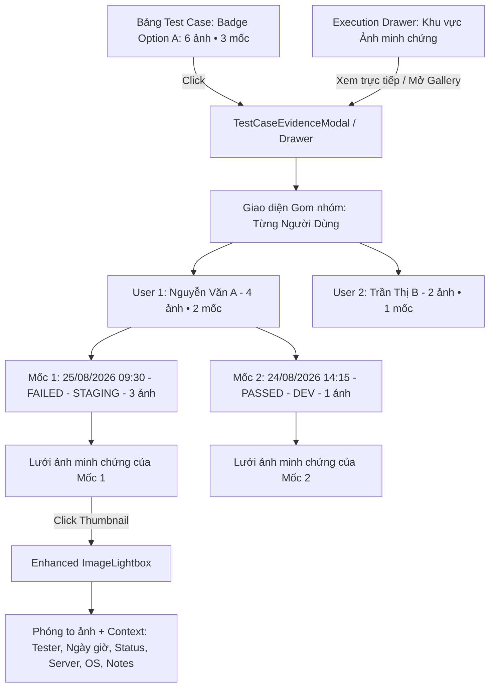

# Kế hoạch điều chỉnh hiển thị ảnh minh chứng Test Case theo Người dùng và Mốc thời gian lịch sử

## Giới thiệu & Mục tiêu
Điều chỉnh cách hiển thị ảnh minh chứng (Evidence Images) của Test Case trên toàn hệ thống theo đúng cấu trúc: **Gom nhóm theo Từng Người dùng (Tester) -> trong mỗi Người dùng có các Mốc thời gian lịch sử (Milestone Timeline) của Test Case**.

### Các quyết định thiết kế đã chốt với người dùng:
1. **Bảng danh sách Test Case (`SuiteDetail.tsx`)**:
   - Badge hiển thị ở cột Tiêu đề theo **Option A**: Thể hiện tổng số ảnh của tất cả các mốc kiểm thử (ví dụ: `📷 6 ảnh • 3 mốc`), khi hover hiển thị tóm tắt danh sách tester đã upload ảnh, khi click mở xem kho ảnh minh chứng.
2. **Khu vực Ảnh minh chứng trên Drawer (`ExecutionDrawer.tsx`)**:
   - Hiển thị trực quan ngay trong Drawer phần Ảnh minh chứng: Cho phép chuyển đổi linh hoạt giữa ảnh tại mốc đang chọn và chế độ xem toàn bộ ảnh gom nhóm theo **Từng Người dùng -> Dòng thời gian các mốc**.
   - Cung cấp nút mở rộng toàn màn hình / Modal Gallery khi cần xem chi tiết.
3. **Cấu trúc hiển thị Gallery ảnh**:
   - Gom nhóm cấp 1: **Từng Người dùng (Tester)** (Tab / Accordion danh sách người đã thực thi test case này).
   - Gom nhóm cấp 2: **Các mốc thời gian (History Milestones)** của người dùng đó (sắp xếp giảm dần từ mới nhất đến cũ nhất).
   - Dưới mỗi mốc hiển thị: Ngày giờ chạy (`HH:mm - DD/MM/YYYY`), Trạng thái (`PASSED/FAILED/BLOCKED`), Môi trường (`Server / OS`), Ghi chú tóm tắt và Lưới ảnh minh chứng của mốc đó.
4. **Trình xem phóng to (`ImageLightbox.tsx`)**:
   - Bổ sung thanh thông tin chi tiết: Tên & Avatar Tester, Mốc thời gian thực hiện, Trạng thái kiểm thử lúc đó (Badge màu), Server & OS, Ghi chú / Nguyên nhân lỗi.

---

## Kiến trúc & Luồng dữ liệu (Architecture & Data Flow)



---

## Chi tiết các thay đổi đề xuất (Proposed Changes)

### 1. Backend: Bổ sung context cho API ảnh & lịch sử

#### [MODIFY] [uploadController.ts](file:///d:/Java%20lean/TestCase/server/src/controllers/uploadController.ts)
- Cập nhật hàm `getTestCaseImages`:
  - Lấy tất cả executions của Test Case kèm relation `images` và `executedBy`.
  - Phân quyền (nếu tester không có quyền xem tất cả thì chỉ lấy executions của chính mình).
  - Trả về cấu trúc ảnh giàu metadata (`executionId`, `executedAt`, `status`, `server`, `os`, `notes`, `actualResult`, `executedBy`).

---

### 2. Frontend: Types & API Client

#### [MODIFY] [types/index.ts](file:///d:/Java%20lean/TestCase/client/src/types/index.ts)
- Cập nhật `TestExecutionImage` để hỗ trợ optional `execution` context info:
  ```typescript
  export interface TestExecutionImage {
    id: string;
    executionId: string;
    filename: string;
    storagePath: string;
    storageType: string;
    mimeType: string;
    fileSize: number;
    publicUrl?: string | null;
    uploadedAt: string;
    execution?: {
      id: string;
      executedAt: string;
      status: ExecutionStatus;
      server?: string | null;
      os?: string | null;
      notes?: string | null;
      actualResult?: string | null;
      executedBy?: {
        id?: string;
        fullName: string;
        email: string;
      } | null;
    };
  }
  ```

---

### 3. Frontend: Components

#### [NEW] [TestCaseEvidenceModal.tsx](file:///d:/Java%20lean/TestCase/client/src/components/TestCaseEvidenceModal.tsx)
- Tạo Modal/Gallery chuyên dụng cho Test Case:
  - **Tabs Tester**: Danh sách các Tester đã từng test Test Case này (kèm số mốc & số ảnh của từng người).
  - **Timeline Mốc thời gian của Tester đang chọn**:
    - Hiển thị từng mốc thực thi theo thứ tự thời gian giảm dần.
    - Card mốc thời gian có: Header mốc (Giờ ngày, StatusBadge, Server/OS, Ghi chú), Lưới thumbnail ảnh.
  - Cho phép nhấp vào ảnh để mở `ImageLightbox` với đầy đủ ngữ cảnh.

#### [MODIFY] [ImageLightbox.tsx](file:///d:/Java%20lean/TestCase/client/src/components/ImageLightbox.tsx)
- Hiển thị thanh metadata phía trên:
  - Tên & Email người thực hiện (Tester).
  - Mốc thời gian thực thi (Timestamp `executedAt`).
  - Badge trạng thái kiểm thử (`PASSED`, `FAILED`, `BLOCKED`).
  - Môi trường (`Server`, `OS`).
  - Ghi chú/kết quả thực tế tóm tắt.
- Chuyển ảnh mượt mà, thumbnail strip bên dưới.

#### [MODIFY] [ExecutionDrawer.tsx](file:///d:/Java%20lean/TestCase/client/src/components/ExecutionDrawer.tsx)
- Cải tiến phần **Ảnh minh chứng**:
  - Khi xem 1 mốc cụ thể: Hiển thị rõ ảnh của mốc đó kèm thông tin Tester & Ngày giờ.
  - Thêm tính năng chuyển đổi chế độ xem: **"Mốc này"** hoặc **"Tất cả ảnh của Tester này"** / **"Toàn bộ ảnh của Test Case"**.
  - Có nút mở **"Kho ảnh minh chứng (Gallery)"** để xem toàn màn hình qua `TestCaseEvidenceModal`.

#### [MODIFY] [SuiteDetail.tsx](file:///d:/Java%20lean/TestCase/client/src/pages/SuiteDetail.tsx)
- **Cột Tiêu đề Test Case (Option A)**:
  - Tính toán tổng số ảnh và số mốc thời gian có ảnh trên toàn bộ `tc.executions`.
  - Hiển thị badge: `📷 {totalImages} ảnh • {totalMilestonesWithImages} mốc` (ví dụ: `6 ảnh • 3 mốc`).
  - Khi click vào badge -> Mở `TestCaseEvidenceModal` để duyệt toàn bộ ảnh theo Từng người dùng & Mốc thời gian.
- **Hàng mở rộng (Expanded Row)**:
  - Giữ card tóm tắt của từng tester, thumbnail ảnh khi click sẽ mở Lightbox có đầy đủ context Tester + Mốc thời gian.

---

## Kế hoạch kiểm thử & Xác minh (Verification Plan)

### Kiểm thử chức năng
1. **Kiểm tra Badge tại Bảng Test Case (`SuiteDetail`)**:
   - Đảm bảo badge hiển thị đúng tổng số ảnh và số mốc (Option A).
   - Bấm vào badge mở đúng `TestCaseEvidenceModal`.
2. **Kiểm tra Modal Gallery theo Từng Người Dùng**:
   - Chọn các tab User khác nhau -> danh sách mốc thời gian và ảnh của từng User thay đổi tương ứng.
   - Các mốc hiển thị đúng ngày giờ, status, server, OS.
3. **Kiểm tra hiển thị trong Execution Drawer**:
   - Chuyển đổi giữa các mốc trong Timeline bên trái -> Phần ảnh minh chứng cập nhật tức thì.
   - Thử các chế độ xem ảnh trong Drawer.
4. **Kiểm tra Enhanced ImageLightbox**:
   - Phóng to ảnh hiển thị đúng Tên Tester, Ngày giờ thực thi, Status badge, Server/OS, Ghi chú.
   - Thử nghiệm zoom, điều hướng tới/lui giữa các ảnh, download.
