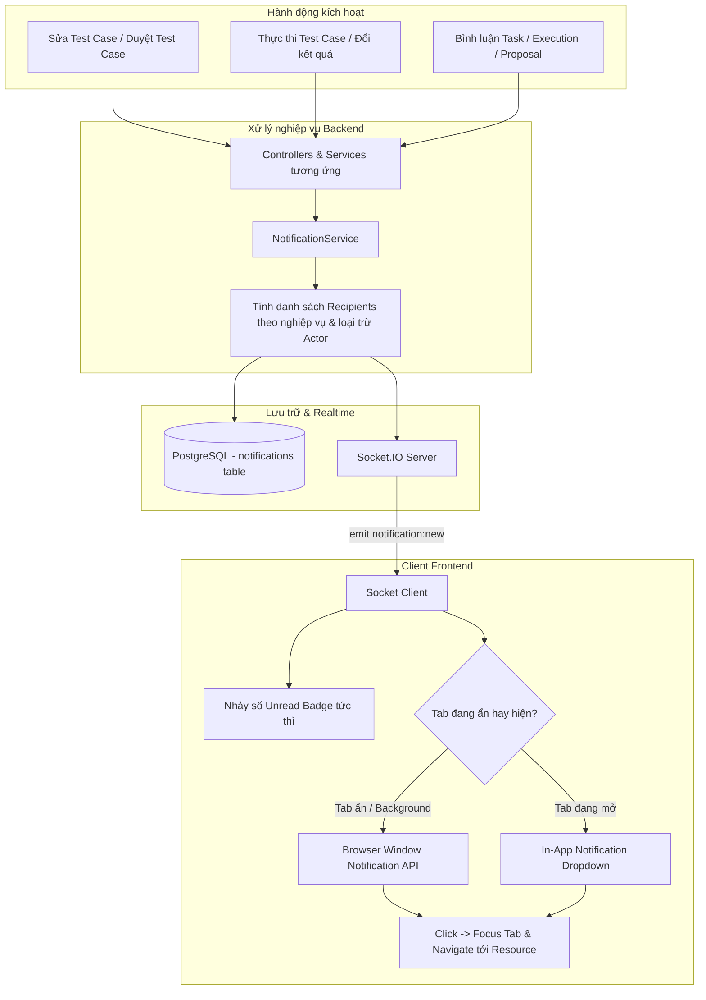

# Kế hoạch Tích hợp Hệ thống Thông báo Toàn diện & Thời gian thực (Realtime Socket.IO + In-App + Browser Notification)

---

## 1. Tổng quan & Mục tiêu

Hệ thống thông báo hợp nhất (Unified Realtime Notification System) được thiết kế nhằm đồng bộ và thông báo tức thời các hoạt động quan trọng trong toàn bộ nền tảng kiểm thử và quản trị quy trình:

1. **Test Case & Test Execution:**
   - Khi **Test Case được cập nhật** (thay đổi nội dung: tiêu đề, điều kiện tiên quyết, các bước, kết quả mong đợi, độ ưu tiên).
   - Khi **Test Case chuyển trạng thái kiểm duyệt** (được phê duyệt `REVIEWED` đơn lẻ hoặc hàng loạt).
   - Khi **Lượt thực thi (Execution) chuyển trạng thái** (`PASSED`, `FAILED`, `BLOCKED`, `RETEST`) hoặc được bàn giao người xử lý.
   - Khi có **bình luận / trao đổi** trong lượt thực thi kiểm thử.
2. **Task (Workflow):**
   - Khi có **bình luận / trao đổi mới** trong nhiệm vụ quy trình.
   - Khi nhiệm vụ chuyển bước hoặc thay đổi trạng thái.
3. **Proposal (Đề xuất):**
   - Khi có bình luận, gửi duyệt, phê duyệt, từ chối, nhắc nhở hạn chót.

### Ba kênh phân phối thông báo đồng thời:
1. **Lưu In-App Notification vào Database** (bảng `notifications` hợp nhất) cho đúng đối tượng thụ hưởng.
2. **Truyền tin thời gian thực qua Socket.IO** (< 500ms) tới người dùng đang trực tuyến để nhảy số badge và hiển thị thông báo tức thì.
3. **Browser Window Notification (Web Push API)** kích hoạt popup của hệ điều hành khi tab ứng dụng đang ẩn hoặc chạy ngầm. Click vào popup sẽ focus tab và điều hướng trực tiếp đến đúng tài nguyên.

---

## 2. Các quyết định kiến trúc quan trọng (Đã chốt)

### Quyết định 1: Tích hợp Socket.IO Realtime
- Khởi tạo Socket.IO Server bọc Express app tại Backend (`http.createServer`).
- Client kết nối Socket.IO kèm JWT token. Server xác thực và đưa socket vào phòng riêng của người dùng: `user:${userId}`.
- Mỗi khi có sự kiện thông báo, Server ghi DB và phát event `notification:new` trực tiếp vào room `user:${recipientId}`.
- Giữ polling dự phòng nhẹ (chu kỳ 60s hoặc khi window focus) để bù đắp nếu mạng bị gián đoạn.

### Quyết định 2: Đối tượng nhận thông báo theo từng nghiệp vụ

| Nghiệp vụ / Sự kiện | Đối tượng nhận thông báo (Recipients) | Loại trừ |
|---|---|---|
| **Test Case được cập nhật** (`TESTCASE_UPDATED`) | • Tester đang được gán thực thi (`executions.executedById`)<br>• Người theo dõi các lượt thực thi (`executions.watchers`)<br>• Người tạo các lượt thực thi (`executions.createdById`) | Người vừa cập nhật Test Case |
| **Test Case được kiểm duyệt** (`TESTCASE_REVIEWED`) | • Tester được gán thực thi test case<br>• Người tạo các lượt thực thi liên quan | Reviewer vừa duyệt |
| **Thực thi chuyển trạng thái** (`EXECUTION_STATUS_CHANGED`) | • Người được bàn giao xử lý tiếp theo (`targetHandlerId` / `executedById`)<br>• Người xử lý bước trước (`beforeExecutedId`)<br>• Người tạo lượt thực thi (`createdById`)<br>• Người theo dõi (`watchers`) | Người vừa cập nhật kết quả |
| **Bình luận Test Execution** (`EXECUTION_COMMENT`) | • Người thực thi (`executedById`)<br>• Người tạo (`createdById`)<br>• Người theo dõi (`watchers`) | Người gửi bình luận |
| **Bình luận Task Workflow** (`TASK_COMMENT`) | • Người tạo task (`createdById`)<br>• Người thực thi task (`executorIds`)<br>• Người theo dõi task (`watcherIds`) | Người gửi bình luận *(Không gửi cho Process Manager)* |
| **Sự kiện Đề xuất** (`PROPOSAL_...`) | • Người tạo đề xuất (`creatorId`)<br>• Người duyệt (`approverIds`)<br>• Người theo dõi (`followers`) | Người thực hiện hành động |

*Ghi chú: Tất cả danh sách người nhận đều được khử trùng lặp (deduplicate qua Set).*

### Quyết định 3: Migrate toàn bộ sang Unified Notification Model
- **Đề xuất và lựa chọn**: Hợp nhất toàn bộ vào bảng `Notification` duy nhất.
- **Lợi ích**: Single Source of Truth, Navbar chỉ cần gọi 1 API, xử lý badge chuẩn xác, "Đọc tất cả" đồng bộ một lần.
- Cung cấp script migrate dữ liệu lịch sử từ bảng `proposal_notifications` cũ sang bảng `notifications` mới. Giữ `/api/proposal-notifications` làm backward-compatible wrapper để không ảnh hưởng code hiện có.

---

## 3. Luồng hoạt động hệ thống (System Architecture)



---

## 4. Chi tiết Thiết kế Cơ sở Dữ liệu & API

### A. Database Schema (`server/prisma/schema.prisma`)

```prisma
enum NotificationType {
  // Test Case & Test Execution
  TESTCASE_UPDATED           // Test Case được chỉnh sửa nội dung
  TESTCASE_REVIEWED          // Test Case được phê duyệt kiểm duyệt
  EXECUTION_COMMENT          // Bình luận trong lượt thực thi
  EXECUTION_STATUS_CHANGED   // Chuyển trạng thái thực thi (PASSED, FAILED, BLOCKED, RETEST)
  EXECUTION_ASSIGNED         // Bàn giao lượt thực thi cho tester mới

  // Task (Workflow)
  TASK_COMMENT               // Bình luận trong nhiệm vụ
  TASK_STATUS_CHANGED        // Thay đổi trạng thái nhiệm vụ
  TASK_STEP_CHANGED          // Nhiệm vụ chuyển bước quy trình
  TASK_ASSIGNED              // Được giao nhiệm vụ mới
  TASK_OVERDUE               // Nhiệm vụ quá hạn

  // Proposal (Đề xuất)
  PROPOSAL_COMMENT           // Bình luận trong đề xuất
  PROPOSAL_SUBMITTED         // Đề xuất mới được gửi duyệt
  PROPOSAL_APPROVED          // Đề xuất được phê duyệt
  PROPOSAL_REJECTED          // Đề xuất bị từ chối
  PROPOSAL_REMINDER          // Nhắc nhở phê duyệt đề xuất
  PROPOSAL_WORKFLOW_STARTED  // Quy trình tự động khởi tạo từ đề xuất
  PROPOSAL_FOLLOWER_ADDED    // Được thêm theo dõi đề xuất
}

model Notification {
  id          String           @id @default(uuid())
  recipientId String           @map("recipient_id")
  recipient   User             @relation("NotificationRecipient", fields: [recipientId], references: [id], onDelete: Cascade)
  type        NotificationType @map("type")
  title       String
  content     String           @db.Text
  isRead      Boolean          @default(false) @map("is_read")
  readAt      DateTime?        @map("read_at")
  
  // Polymorphic References
  testCaseId  String?          @map("test_case_id")
  testCase    TestCase?        @relation("TestCaseNotifications", fields: [testCaseId], references: [id], onDelete: Cascade)
  
  executionId String?          @map("execution_id") 
  execution   TestExecution?   @relation("ExecutionNotifications", fields: [executionId], references: [id], onDelete: Cascade)
  
  taskId      String?          @map("task_id")
  task        Task?            @relation("TaskNotifications", fields: [taskId], references: [id], onDelete: Cascade)
  
  proposalId  String?          @map("proposal_id")
  proposal    Proposal?        @relation("ProposalNotifications", fields: [proposalId], references: [id], onDelete: Cascade)
  
  metadata    Json?            @default("{}")
  createdAt   DateTime         @default(now()) @map("created_at")

  @@index([recipientId, isRead])
  @@index([recipientId, createdAt])
  @@map("notifications")
}
```

### B. REST API Endpoints (`/api/notifications`)

| Phương thức | Endpoint | Mô tả |
|---|---|---|
| `GET` | `/api/notifications` | Lấy danh sách thông báo phân trang (`page`, `limit`, `unreadOnly`) |
| `GET` | `/api/notifications/unread-count` | Lấy tổng số thông báo chưa đọc |
| `PUT` | `/api/notifications/:id/read` | Đánh dấu 1 thông báo đã đọc |
| `PUT` | `/api/notifications/read-all` | Đánh dấu tất cả thông báo đã đọc |
| `DELETE` | `/api/notifications/:id` | Xóa 1 thông báo |

### C. Socket.IO Events

| Tên Event | Chiều | Payload | Mô tả |
|---|---|---|---|
| `notification:new` | Server $\rightarrow$ Client | `Notification` object | Bắn thông báo mới tới room `user:${userId}` |
| `notification:unread_count` | Server $\rightarrow$ Client | `{ unreadCount: number }` | Đồng bộ số lượng chưa đọc mới nhất |
| `notification:read` | Server $\rightarrow$ Client | `{ id?: string, all?: boolean }` | Đồng bộ trạng thái đã đọc giữa các tab của cùng 1 user |

---

## 5. Kế hoạch triển khai theo từng giai đoạn (Phased Implementation Plan) - [ĐÃ HOÀN THÀNH TOÀN BỘ ✅]

```
[Giai đoạn 1] Database & Hạ tầng Realtime (Prisma + Socket.IO Server)       --> [ĐÃ HOÀN THÀNH ✅]
      │
      ▼
[Giai đoạn 2] Backend Core Notification Service & REST API                 --> [ĐÃ HOÀN THÀNH ✅]
      │
      ▼
[Giai đoạn 3] Hooking Triggers vào Test Case, Execution, Task & Proposal   --> [ĐÃ HOÀN THÀNH ✅]
      │
      ▼
[Giai đoạn 4] Frontend Socket Client & Web Browser Notification API        --> [ĐÃ HOÀN THÀNH ✅]
      │
      ▼
[Giai đoạn 5] Nâng cấp UI Navbar (Realtime Badge, Dropdown, Deep links)    --> [ĐÃ HOÀN THÀNH ✅]
      │
      ▼
[Giai đoạn 6] Data Migration, End-to-End Verification & Tối ưu hóa         --> [ĐÃ HOÀN THÀNH ✅]
```

---

### GIAI ĐOẠN 1: Database & Hạ tầng Realtime (Prisma + Socket.IO Server)
**Mục tiêu:** Chuẩn bị lược đồ dữ liệu và nền tảng kết nối socket thời gian thực cho hệ thống.

- **Nhiệm vụ cụ thể:**
  1. Cài đặt thư viện: `cd server && npm install socket.io`
  2. Cập nhật `server/prisma/schema.prisma`:
     - Thêm enum `NotificationType` (gồm đầy đủ các loại sự kiện Test Case, Execution, Task, Proposal).
     - Thêm model `Notification` với các index và relations.
     - Thêm relations tương ứng vào `User`, `TestCase`, `TestExecution`, `Task`, `Proposal`.
  3. Đồng bộ DB: Chạy `npx prisma db push` và sinh Prisma Client `npx prisma generate`.
  4. Tạo module `server/src/socket.ts`:
     - Khởi tạo instance Socket.IO với CORS hỗ trợ đầy đủ origins.
     - Middleware xác thực kết nối bằng JWT token (`auth.token` hoặc `headers.authorization`).
     - Tự động join socket vào room `user:${userId}`.
     - Helper broadcast: `emitToUser(userId, event, data)` và `emitToUsers(userIds, event, data)`.
  5. Cập nhật `server/src/index.ts`:
     - Chuyển `app.listen` sang `http.createServer(app)`.
     - Gắn `initSocket(server)` vào server lifecycle.
- **Tiêu chí hoàn thành (Deliverables):**
  - Prisma Client sinh thành công không có lỗi type.
  - Server khởi động mượt mà, log ghi nhận `Socket.IO Server ready`.

---

### GIAI ĐOẠN 2: Backend Core Notification Service & REST API
**Mục tiêu:** Xây dựng dịch vụ trung tâm xử lý tạo, đếm, cập nhật thông báo và phát socket tương ứng.

- **Nhiệm vụ cụ thể:**
  1. Tạo `server/src/services/notificationService.ts`:
     - CRUD cơ bản: `createNotification`, `createBatchNotifications`, `getNotifications`, `getUnreadCount`, `markAsRead`, `markAllAsRead`, `deleteNotification`.
     - Mỗi khi tạo mới notification $\rightarrow$ tự động gọi `emitToUser(recipientId, 'notification:new', notif)` và `notification:unread_count`.
  2. Xây dựng các hàm trigger chuyên biệt trong `NotificationService`:
     - `onTestCaseUpdated(testCaseId, updaterUserId, changedFields)`:
       - Truy vấn `testCase` kèm các `executions` và `watchers`.
       - Thu thập `recipientIds`: các `executedById`, `watchers.userId`, `createdById`.
       - Lọc trừ `updaterUserId`.
       - Tạo thông báo `TESTCASE_UPDATED` và emit socket.
     - `onTestCaseReviewed(testCaseId, reviewerUserId)`:
       - Thu thập testers liên quan, tạo thông báo `TESTCASE_REVIEWED` và emit socket.
     - `onTestCaseBulkReviewed(testCaseIds[], reviewerUserId)`:
       - Xử lý duyệt hàng loạt, gom nhóm thông báo hợp lý tránh spam.
     - `onExecutionStatusChanged(executionId, actorUserId, oldStatus, newStatus, targetHandlerId)`:
       - Thu thập `targetHandlerId`, `beforeExecutedId`, `createdById`, `watchers`.
       - Tạo thông báo `EXECUTION_STATUS_CHANGED` và emit socket.
     - `onExecutionCommentCreated(executionId, commentUserId, commentContent)`:
       - Tạo thông báo `EXECUTION_COMMENT` và emit socket.
     - `onTaskCommentCreated(taskId, commentUserId, commentContent)`:
       - Lấy `createdById`, `executorIds`, `watcherIds` (trừ `commentUserId`).
       - Tạo thông báo `TASK_COMMENT` và emit socket.
     - `onProposalCommentCreated(proposalId, commentUserId, commentContent)`:
       - Tạo thông báo `PROPOSAL_COMMENT` và emit socket.
  3. Tạo `server/src/controllers/notificationController.ts` & `server/src/routes/notificationRoutes.ts`:
     - Bảo vệ bằng middleware `authenticate`.
     - Đăng ký `app.use('/api/notifications', notificationRoutes)` trong `index.ts`.
- **Tiêu chí hoàn thành (Deliverables):**
  - Đầy đủ bộ endpoint `/api/notifications` hoạt động chính xác qua Postman/curl.
  - Các hàm trigger được type-check đầy đủ, xử lý lỗi an toàn không làm gián đoạn transaction chính.

---

### GIAI ĐOẠN 3: Hooking Triggers vào Test Case, Execution, Task & Proposal
**Mục tiêu:** Kích hoạt gửi thông báo tự động tại tất cả các điểm xảy ra hành động trong codebase.

- **Nhiệm vụ cụ thể:**
  1. **Test Case Controller (`server/src/controllers/testCaseController.ts`):**
     - Tại `updateTestCase`: Sau khi cập nhật thành công, gọi `NotificationService.onTestCaseUpdated(id, currentUserId, updatedFields)`.
     - Tại `reviewTestCase`: Sau khi cập nhật trạng thái kiểm duyệt, gọi `NotificationService.onTestCaseReviewed(id, currentUserId)`.
     - Tại `bulkReview`: Sau khi duyệt hàng loạt, gọi `NotificationService.onTestCaseBulkReviewed(safeIds, currentUserId)`.
  2. **Execution Controller (`server/src/controllers/executionController.ts`):**
     - Tại `executeTestCase` & `updateExecution`: Khi status thay đổi hoặc có bàn giao `executedById`, gọi `NotificationService.onExecutionStatusChanged(...)`.
  3. **Execution Comment Controller (`server/src/controllers/executionCommentController.ts`):**
     - Tại `addComment`: Gọi `NotificationService.onExecutionCommentCreated(...)`.
  4. **Task Comment Service (`server/src/services/commentService.ts`):**
     - Tại `createComment`: Gọi `NotificationService.onTaskCommentCreated(...)`.
  5. **Proposal Service (`server/src/services/proposalService.ts`):**
     - Tại `addComment`: Gọi `NotificationService.onProposalCommentCreated(...)`.
  6. **Cron Service & Proposal Workflow:**
     - Tích hợp gửi thông báo khi đề xuất quá hạn hoặc có nhắc nhở.
- **Tiêu chí hoàn thành (Deliverables):**
  - Mọi thao tác cập nhật/chuyển trạng thái/bình luận đều sinh bản ghi trong bảng `notifications` tương ứng.

---

### GIAI ĐOẠN 4: Frontend Socket Client & Web Browser Notification API
**Mục tiêu:** Cung cấp kết nối realtime và khả năng bắn thông báo ra ngoài màn hình OS cho Client.

- **Nhiệm vụ cụ thể:**
  1. Cài đặt thư viện: `cd client && npm install socket.io-client`
  2. Tạo `client/src/services/socket.ts`:
     - Quản lý lifecycle kết nối socket: `connectSocket(token)`, `disconnectSocket()`, `getSocket()`.
     - Cấu hình tự động kết nối lại (`reconnection: true`, `reconnectionDelay: 2000`).
     - Lắng nghe sự kiện `connect`, `disconnect`, `connect_error`.
  3. Tạo `client/src/utils/browserNotification.ts`:
     - `requestNotificationPermission()`: Xin quyền Notification API từ người dùng.
     - `sendBrowserNotification(title, options)`:
       - Kiểm tra `document.visibilityState === 'hidden'` hoặc kiểm tra tab unfocused.
       - Hiển thị thông báo trình duyệt với `icon`, `body`, `tag` (nhóm thông báo tránh spam).
       - Xử lý sự kiện `onclick`: Gọi `window.focus()` và thực hiện navigation callback.
  4. Tạo `client/src/services/notificationApi.ts`:
     - Wrapper Axios kết nối tới các endpoint `/api/notifications`.
- **Tiêu chí hoàn thành (Deliverables):**
  - Socket kết nối thành công khi người dùng đăng nhập và nhận được event từ server.
  - Browser Window Notification kích hoạt thành công khi tab đang ẩn.

---

### GIAI ĐOẠN 5: Nâng cấp Giao diện Navbar & Trải nghiệm Người dùng (UI/UX)
**Mục tiêu:** Hợp nhất thông báo trên Navbar, hiển thị phân loại trực quan và điều hướng thông minh.

- **Nhiệm vụ cụ thể:**
  1. Cập nhật `client/src/components/Navbar.tsx`:
     - Khởi tạo kết nối Socket khi có `user` & `token`. Ngắt kết nối khi logout.
     - Lắng nghe event `notification:new`:
       - Tăng số badge unread ngay lập tức (+1).
       - Thêm thông báo mới vào đầu mảng `notifications`.
       - Phát âm thanh chuông nhẹ (tùy chọn) và gọi `sendBrowserNotification`.
     - Lắng nghe event `notification:unread_count`: Đồng bộ chuẩn xác số lượng chưa đọc.
     - Lắng nghe event `notification:read`: Đồng bộ trạng thái đã đọc giữa các tab đang mở.
  2. Thiết kế giao diện Dropdown Popover:
     - Badge số lượng chưa đọc hiển thị dạng pill đỏ nổi bật: `9+` nếu > 9.
     - Header có nút "Đánh dấu tất cả đã đọc".
     - Thanh nhắc xin quyền thông báo trình duyệt nếu quyền đang là `default`.
  3. Định danh giao diện và Deep Link cho từng loại thông báo:
     - **`TESTCASE_...`**: Icon Shield/Checklist, màu xanh lam (Sky/Blue) $\rightarrow$ Navigate tới `/testcases/:testCaseId` (hoặc `/testcase-management` nếu duyệt hàng loạt nhiều test case không có ID cụ thể).
     - **`EXECUTION_...`**: Icon TestTube/Flask, màu xanh ngọc (Emerald) $\rightarrow$ Navigate tới `/testcases/:testCaseId?executionId=:executionId` (ExecutionDrawer tự động focus và chọn đúng lượt thực thi vừa thay đổi trạng thái/bình luận).
     - **`TASK_...`**: Icon Layers/CheckSquare, màu chàm (Indigo) $\rightarrow$ Navigate tới `/workflow?taskId=...`.
     - **`PROPOSAL_...`**: Icon FileText, màu hổ phách (Amber) $\rightarrow$ Navigate tới `/proposals/:id`.
  4. Thời gian hiển thị: Định dạng thời gian tương đối (`vừa xong`, `5 phút trước`) hoặc giờ:phút ngày/tháng.
- **Tiêu chí hoàn thành (Deliverables):**
  - Navbar phản hồi tức thời dưới 500ms khi có bất kỳ sự kiện nào.
  - Dropdown hiển thị đẹp mắt, trực quan, click chuyển trang chính xác.

---

### GIAI ĐOẠN 6: Data Migration, End-to-End Verification & Tối ưu hóa
**Mục tiêu:** Chuyển đổi dữ liệu cũ, kiểm thử toàn diện và bảo đảm độ ổn định cao.

- **Nhiệm vụ cụ thể:**
  1. Viết và chạy script `server/src/scripts/migrate_proposal_notifications.ts`:
     - Sao chép toàn bộ dữ liệu từ `proposal_notifications` sang `notifications` mới.
     - Xác minh tính toàn vẹn dữ liệu (số lượng record khớp, không trùng lặp).
  2. Kịch bản kiểm thử End-to-End (E2E):
     - **Test Case Update**: User A sửa Test Case $\rightarrow$ User B (Tester được giao) nhận popup OS + badge Navbar nhảy số.
     - **Test Case Review**: Reviewer duyệt Test Case $\rightarrow$ Tester nhận thông báo "Test Case đã được phê duyệt".
     - **Execution Status Changed**: Tester cập nhật trạng thái `FAILED` $\rightarrow$ Watcher và Creator nhận thông báo kèm ghi chú lỗi.
     - **Task Comment**: Gửi bình luận nhiệm vụ $\rightarrow$ Executor & Watcher nhận thông báo (Process Manager không nhận nếu không liên quan).
     - **Click Navigation**: Click từ browser push notification ngoài màn hình desktop $\rightarrow$ Cửa sổ trình duyệt tự bật lên và mở đúng trang chi tiết.
  3. Tối ưu hiệu năng:
     - Giới hạn payload socket gọn gàng.
     - Debounce các thao tác cập nhật liên tục nếu có.
- **Tiêu chí hoàn thành (Deliverables):**
  - Tất cả kịch bản kiểm thử đều đạt yêu cầu.
  - Hệ thống vận hành ổn định, không có memory leak từ socket connections.

---

## 6. Kế hoạch kiểm thử chi tiết (Verification Checklist)

| # | Kịch bản kiểm thử | Hành động kiểm tra | Kết quả mong đợi |
|---|---|---|---|
| 1 | **Test Case Update** | User A cập nhật `title` và `steps` của Test Case `TC_01` | User B (Tester đang thực thi `TC_01`) nhận notification: *"Test Case TC_01 vừa được cập nhật"*. |
| 2 | **Test Case Review** | Reviewer bấm "Duyệt" `TC_01` | Tester nhận notification: *"Test Case TC_01 đã được phê duyệt"*. |
| 3 | **Execution Status Change** | Tester đổi trạng thái execution sang `FAILED` | Watchers và Creator nhận thông báo realtime với tag FAILED. |
| 4 | **Task Comment** | Thành viên comment vào Task trong Workflow | Creator, Executors, Watchers nhận notification. Process Manager không nhận nếu không trong 3 nhóm trên. |
| 5 | **Deduplication** | User B vừa là Creator vừa là Watcher của Test Execution | User B chỉ nhận **duy nhất 1 notification**, không bị nhân đôi. |
| 6 | **Exclude Actor** | User A tự gửi comment hoặc tự đổi trạng thái | User A **không** nhận thông báo của chính mình. |
| 7 | **Realtime Socket** | Mở 2 tab/browser song song với 2 account khác nhau | Khi User A thao tác, tab User B nhảy số badge trong vòng < 500ms mà không cần F5. |
| 8 | **Browser Push Popup** | Tab User B đang ẩn (chuyển sang phần mềm khác) | Màn hình OS hiện popup thông báo của trình duyệt. Click popup $\rightarrow$ focus tab và chuyển trang đúng. |
| 9 | **Reconnection** | Tắt mạng 5s rồi bật lại | Socket tự động kết nối lại, badge đồng bộ đúng số lượng. |
| 10 | **Data Migration** | Chạy script migrate dữ liệu cũ | Tất cả thông báo đề xuất cũ xuất hiện đầy đủ trong dropdown hợp nhất mới. |
