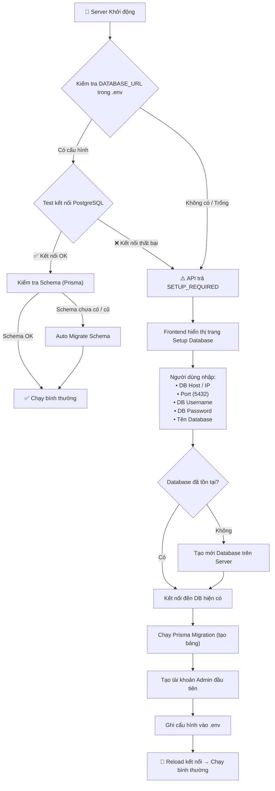
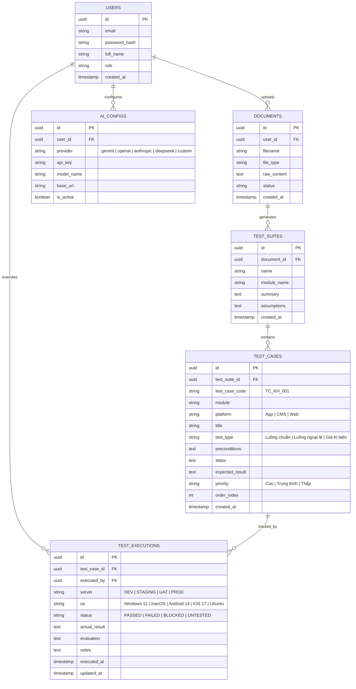

# Kế hoạch Triển khai Hệ thống Phân tích Tài liệu & Quản lý Kiểm thử Tự động (AI Test Case Generator & Management System)

Dự án xây dựng một ứng dụng web Full-stack toàn diện cho phép người dùng đăng ký/đăng nhập, tải lên tài liệu yêu cầu (PDF/TXT/DOCX), sử dụng AI (hỗ trợ đa nhà cung cấp: Google Gemini, OpenAI, Claude, DeepSeek...) để tự động phân tích và sinh bộ Test Case chuẩn. Đồng thời, hệ thống cung cấp giao diện quản lý thực thi kiểm thử (nhập Server, Hệ điều hành, Kết quả thực tế, Đánh giá Pass/Fail, Ghi chú, gắn cờ lỗi thất bại), cơ chế khởi tạo Database tự động dạng Odoo Database Manager, lưu trữ toàn bộ dữ liệu vào PostgreSQL và xuất báo cáo Excel định dạng chuyên nghiệp.

---

## User Review Required

> [!IMPORTANT]
> **Các điểm kiến trúc & công nghệ chính:**
> 1. **Khởi tạo & Quản lý Database (Tương tự Odoo)**:
>    - Khi hệ thống chưa kết nối được DB, tự động chuyển hướng đến trang Setup Wizard 4 bước.
>    - Cho phép nhập Host/Port/User/Password, test kết nối, liệt kê DB, tạo DB mới, tự động chạy Prisma migration và tạo tài khoản Admin đầu tiên.
> 2. **Tech Stack**:
>    - **Backend**: Node.js (Express + TypeScript) + Prisma ORM + `pg` native driver + PostgreSQL.
>    - **Frontend**: React (Vite) + TypeScript + Tailwind CSS + Lucide Icons.
>    - **Database**: PostgreSQL lưu trữ Users, Documents, TestSuites, TestCases, TestExecutions, AIConfigs.
> 3. **AI Provider Config**: Hỗ trợ Google Gemini, OpenAI GPT-4o, Claude 3.5, DeepSeek v3, Ollama/Local trực tiếp trên giao diện Settings.
> 4. **Thực thi Test Case**: Giao diện Drawer trực quan, chọn/nhập **Môi trường Server** (DEV, STAGING, PROD...), **Hệ điều hành** (Windows, macOS, Android, iOS...), cập nhật trạng thái (`PASSED`, `FAILED`, `BLOCKED`, `UNTESTED`), nhập Kết quả thực tế, Đánh giá, Ghi chú và highlight màu sắc cảnh báo cho các case thất bại.
> 5. **Xuất Excel Chuẩn Đẹp**: Xuất file `.xlsx` theo mẫu chuẩn (màu sắc header, phân màu App/CMS, tô màu kết quả thực thi và cột Server, OS).

---

## Kiến trúc Hệ thống & Cơ sở dữ liệu (PostgreSQL Schema)

### Luồng Database Setup (Tương tự Odoo)

### PostgreSQL Schema

---

## Chi tiết Triển khai

### 1. Database Setup & Initialization Module (Tương tự Odoo)
- **`server/src/services/databaseSetup.ts`**:
  - `testConnection()`: Kiểm tra kết nối PostgreSQL server thông qua `pg.Client`.
  - `listDatabases()`: Liệt kê danh sách database có trên server.
  - `createDatabase()`: Tạo database mới an toàn (`CREATE DATABASE`).
  - `runMigration()`: Chạy `prisma migrate deploy` hoặc `prisma db push`.
  - `createAdminUser()`: Tạo tài khoản Admin đầu tiên (mã hoá bcrypt).
  - `updateEnvFile()`: Lưu `DATABASE_URL` vào `.env`.
- **`server/src/config/database.ts`**:
  - Quản lý kết nối Prisma Client bằng Proxy pattern, hỗ trợ `reinitializePrisma()`.
- **`server/src/controllers/setupController.ts` & `server/src/routes/setupRoutes.ts`**:
  - Endpoint `/api/setup/status`, `/api/setup/test-connection`, `/api/setup/create-database`, `/api/setup/initialize`.
  - Middleware `dbCheckMiddleware`: Chặn API khi DB chưa sẵn sàng (trả về 503 `SETUP_REQUIRED`).
- **`client/src/pages/Setup/DatabaseSetupPage.tsx`**:
  - Wizard 4 bước: (1) Kết nối Server -> (2) Chọn/Tạo Database -> (3) Tạo Admin -> (4) Khởi tạo hệ thống.
- **`client/src/App.tsx`**:
  - Tự động kiểm tra trạng thái và điều hướng tới `/setup` nếu cần.

### 2. Backend Service (Node.js + Express + PostgreSQL + Prisma)
- **`prisma/schema.prisma`**: Đầy đủ models `User`, `Document`, `TestSuite`, `TestCase`, `TestExecution` (có `server` và `os`), `AiConfig`.
- **`server/src/services/ai/aiService.ts`**: Multi-provider AI Adapter (Gemini, OpenAI, Claude, DeepSeek).
- **`server/src/services/documentParser.ts`**: Bộ đọc PDF, DOCX, TXT.
- **`server/src/services/excelExporter.ts`**: Module xuất file Excel `.xlsx` chuyên nghiệp với ExcelJS (màu sắc header, phân biệt App/CMS, cột Server, OS, kết quả kiểm thử).
- **`server/src/controllers/`**: `authController`, `aiController`, `testCaseController`, `executionController`, `exportController`.

### 3. Frontend Application (React + Vite + Tailwind CSS)
- **`client/src/pages/Auth/`**: `Login.tsx`, `Register.tsx`.
- **`client/src/pages/Dashboard.tsx`**: Bảng điều khiển thống kê tổng quan (Suites, Test Cases, Pass Rate, Failed Cases).
- **`client/src/pages/Generate.tsx`**: Kéo thả tài liệu, chọn Provider AI & Model, sinh Test Case tự động.
- **`client/src/pages/SuiteDetail.tsx`**: Bảng chi tiết Test Case, Drawer thực thi (Server, OS, kết quả thực tế, đánh giá Pass/Fail, badge cảnh báo FAILED).
- **`client/src/pages/Settings.tsx`**: Quản lý API Keys AI và trạng thái kết nối PostgreSQL.

---

## Kế hoạch Thực hiện (Phases)

| Phase | Nội dung công việc | Trạng thái |
| :--- | :--- | :--- |
| **Phase 0: Database Setup Module** ⭐ | - Service `databaseSetup.ts` (test connection, create DB, run migration, create admin). - Routes `/api/setup/*` & `dbCheckMiddleware`. - Frontend `DatabaseSetupPage.tsx` dạng wizard 4 bước. - Auto-redirect logic khi DB chưa kết nối. | ✅ Hoàn thành |
| **Phase 1: Setup & Database** | - Schema Prisma PostgreSQL (User, Document, TestCase, TestExecution với `server`, `os`). - Kết nối DB và migration. | ✅ Hoàn thành |
| **Phase 2: Auth & User Management** | - Backend Auth API (Register, Login, JWT Middleware). - Frontend Login/Register & AuthContext. | ✅ Hoàn thành |
| **Phase 3: Multi-Provider AI Engine** | - AI Service (Gemini, OpenAI, Claude, DeepSeek). - Document Parser (PDF/TXT/DOCX). - Frontend Generate Studio. | ✅ Hoàn thành |
| **Phase 4: Test Case Execution & Detail View** | - Bảng danh sách Test Case, Drawer chi tiết. - Form nhập: Server, OS, Actual Result, Status, Notes. - Badge cảnh báo FAILED trực quan & bộ lọc. | ✅ Hoàn thành |
| **Phase 5: Excel Export & Dashboard Stats** | - Engine xuất Excel (.xlsx) với ExcelJS. - Dashboard thống kê tiến độ kiểm thử. | ✅ Hoàn thành |
| **Phase 6: Verification & Polish** | - Kiểm tra typecheck TypeScript (`server` + `client`). - Kiểm thử toàn diện các luồng. | ✅ Hoàn thành |

---

## Hướng dẫn Sử dụng Tính năng Khởi tạo Database (Odoo-like)

1. Mở trình duyệt truy cập: `http://localhost:5173/setup` (hoặc mở ứng dụng tại `http://localhost:5173`, hệ thống sẽ tự phát hiện và chuyển đến trang Setup).
2. **Bước 1 - Kết nối Server**: Nhập `Host` (VD: `localhost`), `Port` (5432), `Username` (VD: `postgres`), `Password` -> Nhấn **"Test Kết nối"**.
3. **Bước 2 - Chọn Database**: Chọn một database có sẵn hoặc nhập tên database mới (VD: `testcase_db`) -> Nhấn **"Tạo Database Ngay"**.
4. **Bước 3 - Tài khoản Admin**: Nhập Họ tên, Email (VD: `admin@company.com`), Mật khẩu Admin.
5. **Bước 4 - Khởi tạo Hệ thống**: Nhấn **"🚀 Khởi tạo Hệ thống"**. Hệ thống sẽ tự động chạy migration, tạo bảng và tạo tài khoản Admin, sau đó chuyển hướng đến trang Đăng nhập.
