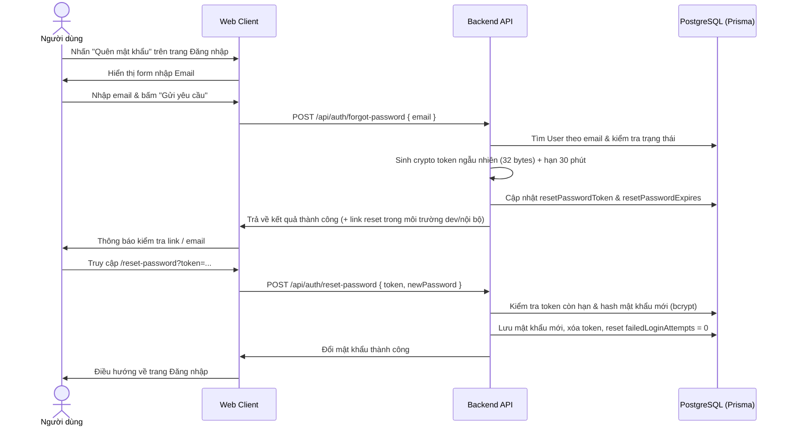
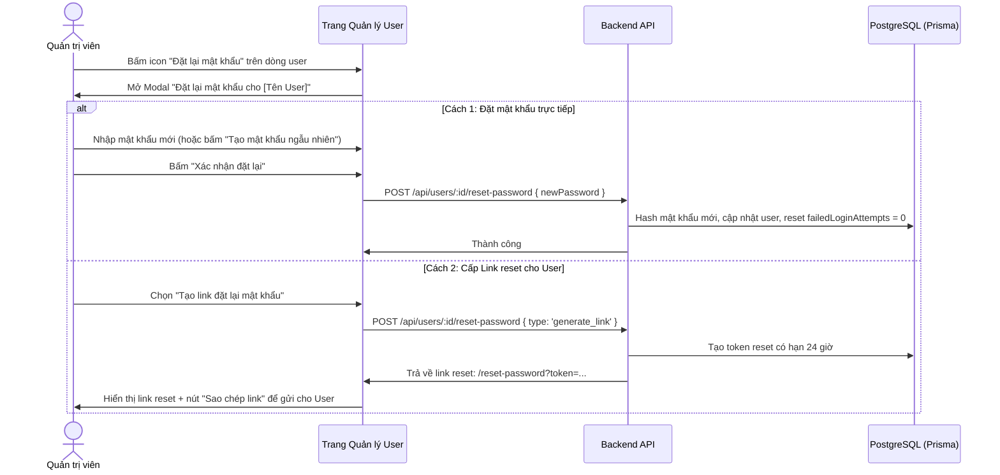

# Kế hoạch Triển khai: Tính năng Quên mật khẩu & Admin Đặt lại mật khẩu cho Người dùng

Tài liệu này mô tả chi tiết phương án kỹ thuật và các bước triển khai cho 2 tính năng:
1. **Quên mật khẩu (Forgot Password)**: Người dùng tự yêu cầu đặt lại mật khẩu khi bị quên.
2. **Admin Reset mật khẩu cho User**: Quản trị viên chủ động đặt lại mật khẩu mới hoặc cấp link đặt lại mật khẩu cho bất kỳ tài khoản người dùng nào từ trang Quản lý Người dùng.

---

## 1. Phân tích hiện trạng hệ thống

- **Backend**: Express + TypeScript + Prisma ORM (PostgreSQL) + JWT + Bcrypt.
  - Hiện tại, `authController.ts` đã có các endpoint: `register`, `login`, `getMe`, `updateProfile`, `disableAccount`, `toggleAccountStatus`.
  - `usersRoutes.ts` quản lý danh sách user, tạo, sửa thông tin, xóa, khóa/mở khóa tài khoản.
  - `model User` trong `schema.prisma` chưa có các trường lưu token phục hồi mật khẩu (`resetPasswordToken`, `resetPasswordExpires`).
- **Frontend**: React + Vite + TailwindCSS + Lucide Icons + React Router.
  - Màn hình `Login.tsx` chưa có liên kết "Quên mật khẩu?".
  - Màn hình `UserManagement.tsx` hiện chỉ có 3 hành động: Sửa thông tin, Khóa/Mở khóa, Xóa tài khoản; chưa có nút "Đặt lại mật khẩu".

---

## 2. Thiết kế giải pháp

### A. Tính năng "Quên mật khẩu" (Dành cho người dùng)

### B. Tính năng "Admin Đặt lại mật khẩu cho User" (Dành cho Quản trị viên)

---

## 3. Chi tiết các thay đổi dự kiến

### 3.1. Database (Prisma Schema)
#### [MODIFY] [schema.prisma](file:///d:/Java%20lean/TestCase/server/prisma/schema.prisma)
Thêm 2 trường vào `model User`:
- `resetPasswordToken String? @map("reset_password_token")`
- `resetPasswordExpires DateTime? @map("reset_password_expires")`
Chạy `npx prisma db push` và `npx prisma generate`.

---

### 3.2. Backend API

#### [MODIFY] [authController.ts](file:///d:/Java%20lean/TestCase/server/src/controllers/authController.ts)
Thêm 3 methods:
1. `forgotPassword(req, res)`:
   - Nhận `email`.
   - Kiểm tra user tồn tại và không bị khóa vĩnh viễn.
   - Dùng `crypto.randomBytes(32).toString('hex')` sinh token.
   - Lưu vào DB hạn 30 phút.
   - Trả về thông điệp thành công (kèm `resetUrl` để dễ dàng thử nghiệm và sử dụng trong mạng nội bộ).
2. `verifyResetToken(req, res)`:
   - Nhận `token` qua query/body để kiểm tra tính hợp lệ trước khi user nhập mật khẩu.
3. `resetPassword(req, res)`:
   - Nhận `{ token, newPassword }`.
   - Validate độ dài mật khẩu (tối thiểu 6 ký tự).
   - Mã hóa mật khẩu bằng `bcrypt.hash(newPassword, 10)`.
   - Cập nhật DB, xóa `resetPasswordToken` và `resetPasswordExpires`, reset `failedLoginAttempts = 0`.

#### [MODIFY] [authRoutes.ts](file:///d:/Java%20lean/TestCase/server/src/routes/authRoutes.ts)
Khai báo routes công khai:
- `POST /api/auth/forgot-password` -> `AuthController.forgotPassword`
- `GET /api/auth/verify-reset-token` -> `AuthController.verifyResetToken`
- `POST /api/auth/reset-password` -> `AuthController.resetPassword`

#### [MODIFY] [usersRoutes.ts](file:///d:/Java%20lean/TestCase/server/src/routes/usersRoutes.ts)
Thêm route cho Admin:
- `POST /api/users/:id/reset-password`:
  - Yêu cầu xác thực (`authenticate`) và quyền (`requirePermission('users:update')` hoặc role ADMIN).
  - Hỗ trợ 2 chế độ:
    1. Đặt mật khẩu trực tiếp: Nhận `newPassword`, hash bcrypt, cập nhật DB, mở khóa nếu bị tạm khóa do nhập sai nhiều lần.
    2. Cấp link reset: Nhận `type: 'generate_link'`, tạo token có hạn 24 giờ và trả về URL đặt lại mật khẩu để Admin gửi cho nhân viên.

---

### 3.3. Frontend Web Client

#### [MODIFY] [api.ts](file:///d:/Java%20lean/TestCase/client/src/services/api.ts)
Bổ sung hàm API:
- `authApi.forgotPassword(data: { email: string })`
- `authApi.verifyResetToken(token: string)`
- `authApi.resetPassword(data: { token: string; newPassword: string })`
- `userApi.adminResetPassword(userId: string, data: { newPassword?: string; type?: 'manual' | 'generate_link' })`

#### [NEW] [ForgotPassword.tsx](file:///d:/Java%20lean/TestCase/client/src/pages/ForgotPassword.tsx)
- Giao diện đẹp mắt, đồng bộ phong cách với trang Login/Register.
- Form nhập email, hiển thị thông báo trạng thái, hỗ trợ copy nhanh link reset trực tiếp nếu trả về.
- Nút quay lại trang Đăng nhập.

#### [NEW] [ResetPassword.tsx](file:///d:/Java%20lean/TestCase/client/src/pages/ResetPassword.tsx)
- Kiểm tra tính hợp lệ của token ngay khi load trang.
- Form nhập mật khẩu mới + xác nhận mật khẩu.
- Nút ẩn/hiện mật khẩu, thanh đo độ mạnh mật khẩu (Strength Meter).
- Trạng thái thành công và nút chuyển về Đăng nhập.

#### [MODIFY] [Login.tsx](file:///d:/Java%20lean/TestCase/client/src/pages/Login.tsx)
- Thêm link **"Quên mật khẩu?"** nằm phía trên hoặc bên cạnh trường mật khẩu.

#### [MODIFY] [App.tsx](file:///d:/Java%20lean/TestCase/client/src/App.tsx)
- Thêm các Route mới:
  - `<Route path="/forgot-password" element={<ForgotPassword />} />`
  - `<Route path="/reset-password" element={<ResetPassword />} />`
- Cập nhật danh sách URL công khai để không bị tự động chuyển hướng về `/login`.

#### [MODIFY] [UserManagement.tsx](file:///d:/Java%20lean/TestCase/client/src/pages/UserManagement.tsx)
- Thêm nút hành động **"Đặt lại mật khẩu"** (icon `Key` / `ShieldAlert`) trong cột Thao tác của từng người dùng.
- Thêm Modal `ResetPasswordModal` hiện đại:
  - Hiển thị thông tin người dùng được chọn.
  - Tab 1: **Đặt mật khẩu trực tiếp**:
    - Trường nhập mật khẩu mới.
    - Nút **"Tạo mật khẩu ngẫu nhiên"** (Random Strong Password Generator) + nút **"Sao chép"** tiện lợi.
  - Tab 2: **Tạo link đặt lại mật khẩu**:
    - Tạo link reset dùng 1 lần (hạn 24h) để Admin gửi qua Zalo/Chat/Email cho nhân viên tự thao tác.
  - Xử lý loading và toast thông báo mượt mà.

---

## 4. Kế hoạch kiểm thử & xác minh

### 4.1. Kiểm thử tính năng Quên mật khẩu (User)
1. Truy cập `/login`, nhấn "Quên mật khẩu?".
2. Nhập email hợp lệ -> bấm "Gửi yêu cầu" -> kiểm tra phản hồi từ server.
3. Truy cập đường dẫn `/reset-password?token=...`.
4. Nhập mật khẩu mới, kiểm tra xác nhận mật khẩu không khớp và mật khẩu hợp lệ.
5. Gửi form -> kiểm tra thông báo thành công và đăng nhập lại bằng mật khẩu mới.
6. Thử dùng lại link cũ vừa reset -> kiểm tra token đã bị hủy và báo lỗi phù hợp.

### 4.2. Kiểm thử tính năng Admin Đặt lại mật khẩu (Admin)
1. Đăng nhập bằng tài khoản Admin, vào trang **Quản lý Người dùng** (`/user-management`).
2. Tìm một user, bấm nút icon "Đặt lại mật khẩu".
3. Thử tính năng **"Tạo mật khẩu ngẫu nhiên"** -> sao chép mật khẩu -> xác nhận đặt lại.
4. Đăng nhập thử bằng tài khoản user với mật khẩu vừa được Admin đặt lại.
5. Thử tính năng **"Tạo link đặt lại mật khẩu"** -> sao chép link và mở trình duyệt để đổi mật khẩu.
6. Kiểm tra user sau khi được reset đã được xóa bộ đếm đăng nhập sai (`failedLoginAttempts: 0`).
