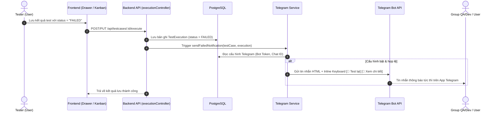
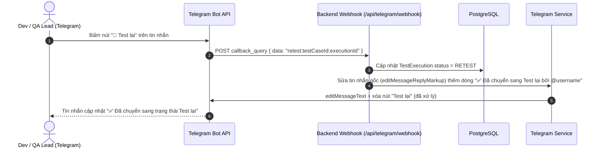

# Kế hoạch Triển khai: Tự động Gửi Thông báo Telegram khi Test Case Bị FAILED

Tài liệu này mô tả chi tiết thiết kế và kế hoạch triển khai tính năng **tự động gửi thông báo qua Telegram Bot** khi có bất kỳ kịch bản kiểm thử nào được ghi nhận trạng thái **`FAILED`** (Thất bại) trong hệ thống quản lý TestCase.

> [!IMPORTANT]
> **Tính năng mới**: Người nhận tin nhắn trên Telegram có thể bấm nút **"🔁 Test lại"** ngay dưới tin nhắn để chuyển trạng thái Test Case sang `RETEST` mà không cần mở trình duyệt web.

---

## 1. Mục tiêu & Luồng hoạt động

### 🎯 Mục tiêu
- Giúp đội ngũ QA, Developer và Quản lý dự án nhận được thông báo lỗi ngay lập tức mà không cần phải túc trực trên giao diện web.
- Tin nhắn chứa đầy đủ thông tin bối cảnh lỗi: Mã TC, Module, Môi trường, Người test, Kết quả mong đợi, Kết quả thực tế, Ghi chú và Link truy cập trực tiếp.
- **Người nhận có thể phản hồi ngay trên Telegram** bằng cách bấm nút **"🔁 Test lại"** (Inline Keyboard Button) để chuyển trạng thái test case sang `RETEST`.

### 🔄 Luồng hoạt động chính (Gửi thông báo)


### 🔁 Luồng phản hồi "Test lại" từ Telegram (Callback Query)


---

## 2. Thiết kế Tin nhắn Telegram (Message Format)

Tin nhắn gửi tới Telegram sẽ được định dạng bằng **HTML format** đẹp mắt, rõ ràng và đầy đủ:

```html
🚨 <b>[CẢNH BÁO] TEST CASE THẤT BẠI (FAILED)</b>
━━━━━━━━━━━━━━━━━━━━━
📌 <b>Mã kịch bản:</b> <code>TC_015</code>
🏷️ <b>Bộ Suite:</b> Quản lý Sản phẩm - Version 1.0
🧩 <b>Chức năng:</b> Danh sách sản phẩm (App)
⚡ <b>Độ ưu tiên:</b> 🔴 Cao | <b>Loại test:</b> Luồng ngoại lệ

🖥️ <b>Môi trường:</b> Server: <code>STAGING</code> | OS: <code>Android 14</code>
👤 <b>Người kiểm thử:</b> Nguyễn Văn A (tester@vinago.com)
⏰ <b>Thời gian:</b> 25/08/2026 16:45:00

📋 <b>Các bước thực hiện:</b>
1. Mở màn hình danh sách sản phẩm
2. Kéo xuống cuối trang để load more
3. Tắt kết nối mạng rồi bấm thử lại

🎯 <b>Kết quả mong đợi:</b>
Hiển thị thông báo "Mất kết nối Internet" và nút Thử lại.

❌ <b>Kết quả thực tế:</b>
Ứng dụng bị văng (Crash App), không hiển thị thông báo lỗi.

📝 <b>Ghi chú / Link Bug:</b>
Jira ticket: PROD-1024
━━━━━━━━━━━━━━━━━━━━━
```

### Nút Inline Keyboard (Dưới tin nhắn)

Mỗi tin nhắn cảnh báo sẽ đính kèm **2 nút bấm** trực tiếp dưới tin nhắn (Inline Keyboard):

| Nút | Hành vi |
|:---|:---|
| **🔁 Test lại** | Bấm → Backend nhận `callback_query`, cập nhật trạng thái test case sang `RETEST`, sửa tin nhắn gốc thêm dòng `✅ Đã chuyển sang Test lại bởi @username lúc HH:mm` và xóa nút |
| **🔗 Xem chi tiết** | Bấm → Mở link trực tiếp tới trang chi tiết Test Case trên trình duyệt web |

Sau khi bấm **"🔁 Test lại"**, tin nhắn sẽ được sửa lại (editMessage) để hiển thị:
```html
━━━━━━━━━━━━━━━━━━━━━
✅ <b>Đã chuyển sang trạng thái "Test lại" bởi @devlead lúc 16:50</b>
```
Và nút "🔁 Test lại" sẽ bị **xóa/ẩn đi** để tránh bấm trùng lặp.

---

## 3. Kiến trúc Cấu hình & Quản lý (Configuration)

### 3.1. Cấu hình cấp Hệ thống (System Settings - Dành cho Quản trị viên)
- **Kích hoạt thông báo (Enable/Disable)**: Bật/Tắt tính năng thông báo Telegram toàn hệ thống.
- **Telegram Bot Token**: Token tạo từ `@BotFather` (ví dụ: `7123456789:AAH...`).
- **Chat ID Mặc định (Group / Channel ID)**: ID nhóm chat QA/Dev để nhận thông báo tập trung (ví dụ: `-1001234567890`).
- **Webhook URL**: URL public mà Telegram sẽ gọi khi có người bấm nút (ví dụ: `https://testcase.vinago.com/api/telegram/webhook`). Hệ thống sẽ tự động đăng ký webhook khi admin bật tính năng callback.
- **Bật/tắt nút phản hồi "Test lại"**: Cho phép hoặc tắt nút inline "🔁 Test lại" trong tin nhắn.
- **Tùy chọn đính kèm ảnh**: Bật/tắt tự động gửi ảnh chụp lỗi đính kèm nếu tester có upload.
- **Nút "Gửi thử tin nhắn (Test Connection)"**: Kiểm tra bot token và chat ID có hoạt động không trước khi lưu.

### 3.2. Cấu hình cấp Người dùng cá nhân (Personal Notification - Tùy chọn)
- Thêm trường `telegramChatId` trong trang Profile/Thông tin cá nhân của User:
  - Khi có testcase failed, ngoài việc gửi vào Group chung, bot có thể gửi tin nhắn riêng cho tester hoặc người phụ trách module.

---

## 4. Chi tiết các tệp cần tạo & chỉnh sửa (Proposed Changes)

### Database & Prisma
#### [MODIFY] [schema.prisma](file:///d:/Java%20lean/TestCase/server/prisma/schema.prisma)
- Thêm trường `telegramChatId String? @map("telegram_chat_id")` vào model `User`.
- Sử dụng bảng `SystemSetting` sẵn có với key `telegram_config` lưu trữ JSON cấu hình:
  ```json
  {
    "enabled": true,
    "botToken": "7123456789:AAH...",
    "defaultChatId": "-1001234567890",
    "webhookUrl": "https://testcase.vinago.com/api/telegram/webhook",
    "notifyOnFailed": true,
    "notifyOnBlocked": false,
    "attachImages": true,
    "enableRetestButton": true
  }
  ```

#### [NEW] `server/prisma/migrations/YYYYMMDD_add_telegram_chat_id_to_user/migration.sql`
- Migration bổ sung cột `telegram_chat_id` vào bảng `users`.

---

### Backend (Server)

#### [NEW] [telegramService.ts](file:///d:/Java%20lean/TestCase/server/src/services/telegramService.ts)
- Hàm `getTelegramConfig()`: Đọc cấu hình từ `SystemSetting`.
- Hàm `sendTelegramMessage(chatId, text, options)`: Gửi HTTP POST tới `https://api.telegram.org/bot<TOKEN>/sendMessage` với HTML parse_mode và inline_keyboard.
- Hàm `sendTelegramPhoto(chatId, photoUrlOrBuffer, caption)`: Gửi ảnh đính kèm lỗi nếu có.
- Hàm `notifyTestCaseFailed(params)`: Format nội dung HTML chuẩn đẹp, đính kèm **Inline Keyboard** với 2 nút `[🔁 Test lại]` và `[🔗 Xem chi tiết]`, gọi gửi bất đồng bộ.
- Hàm `testTelegramConnection(botToken, chatId)`: Gửi tin nhắn test mẫu để kiểm tra.
- Hàm `setWebhook(botToken, webhookUrl)`: Đăng ký webhook URL với Telegram Bot API.
- Hàm `editMessageAfterRetest(chatId, messageId, retestByName)`: Sửa tin nhắn gốc thêm dòng xác nhận và xóa nút "Test lại".

#### [NEW] [telegramController.ts](file:///d:/Java%20lean/TestCase/server/src/controllers/telegramController.ts) & [telegramRoutes.ts](file:///d:/Java%20lean/TestCase/server/src/routes/telegramRoutes.ts)
- `GET /api/settings/telegram`: Lấy cấu hình Telegram (mask bot token).
- `PUT /api/settings/telegram`: Lưu cấu hình Telegram (yêu cầu quyền Admin). Nếu bật callback, tự động gọi `setWebhook`.
- `POST /api/settings/telegram/test`: Gửi tin nhắn thử nghiệm.
- `POST /api/telegram/webhook` **(PUBLIC, không cần auth)**: Nhận `callback_query` từ Telegram khi người dùng bấm nút inline.
  - Parse `callback_data` có dạng `retest:<testCaseId>:<executionId>`.
  - Tìm `TestExecution` tương ứng, kiểm tra trạng thái hiện tại.
  - Nếu vẫn là `FAILED` → cập nhật sang `RETEST`.
  - Gọi `answerCallbackQuery` để hiển thị toast trên Telegram: "✅ Đã chuyển sang Test lại".
  - Gọi `editMessageReplyMarkup` để xóa nút "🔁 Test lại" và thêm dòng xác nhận vào cuối tin nhắn.
  - Nếu đã không còn `FAILED` (đã được xử lý trước đó) → trả về toast "⚠️ Test case này đã được xử lý rồi".

> [!WARNING]
> Endpoint `/api/telegram/webhook` phải được public (không yêu cầu JWT auth) vì Telegram gọi trực tiếp. Nên bảo mật bằng cách kiểm tra **webhook secret token** (Telegram hỗ trợ header `X-Telegram-Bot-Api-Secret-Token`) để chống request giả mạo.

#### [MODIFY] [executionController.ts](file:///d:/Java%20lean/TestCase/server/src/controllers/executionController.ts)
- Trong `executeTestCase` và `updateExecution`:
  - Kiểm tra nếu `executionStatus === 'FAILED'`, gọi `telegramService.notifyTestCaseFailed(...)` trong background (không block response).

---

### Frontend (Client)

#### [NEW] [TelegramSettingsTab.tsx](file:///d:/Java%20lean/TestCase/client/src/components/TelegramSettingsTab.tsx)
- Giao diện cấu hình Telegram trong trang **Cài đặt (Settings)**:
  - Form nhập Bot Token, Group Chat ID, Webhook URL.
  - Switch bật/tắt thông báo khi Failed / Blocked.
  - Switch bật/tắt nút phản hồi "🔁 Test lại" trong tin nhắn.
  - Nút Test kết nối với hiệu ứng loading và thông báo kết quả.
  - Hướng dẫn từng bước cách tạo Bot qua `@BotFather` và lấy Chat ID qua `@RawDataBot`.

#### [MODIFY] [Settings.tsx](file:///d:/Java%20lean/TestCase/client/src/pages/Settings.tsx)
- Tích hợp thêm tab **"Thông báo Telegram"** vào thanh điều hướng cài đặt.

#### [MODIFY] [api.ts](file:///d:/Java%20lean/TestCase/client/src/services/api.ts) & [types/index.ts](file:///d:/Java%20lean/TestCase/client/src/types/index.ts)
- Bổ sung interface `TelegramConfig` và các API endpoints: `getTelegramConfig`, `updateTelegramConfig`, `testTelegramConnection`.

---

## 5. Open Questions (Cần xác nhận từ bạn)

> [!IMPORTANT]
> **Webhook URL**: Để tính năng bấm nút "🔁 Test lại" hoạt động, server cần phải có **URL public** (domain HTTPS) để Telegram gọi webhook. Bạn hiện tại có domain public cho hệ thống không (ví dụ: `https://testcase.vinago.com`)? Nếu chưa có, tôi sẽ triển khai phương án polling thay cho webhook.

> [!NOTE]
> **Phương án thay thế (không cần webhook)**: Nếu không muốn cấu hình webhook, có thể dùng **Long Polling** — server chạy một tiến trình nền liên tục poll `getUpdates` từ Telegram mỗi vài giây. Tuy nhiên webhook hiệu quả và phản hồi nhanh hơn nhiều.

---

## 6. Kế hoạch Kiểm thử & Xác minh (Verification Plan)

### Kiểm thử Tự động & Build
- `npm run prisma:generate` & `npm run prisma:migrate`.
- `npm run build` (Server) & `npm run build` (Client).

### Kiểm thử Thực tế (Manual Verification)
1. **Kiểm tra Cấu hình**:
   - Nhập Token bot và Chat ID nhóm test vào trang Cài đặt.
   - Bấm **"Gửi thử tin nhắn"** → Kiểm tra xem nhóm Telegram có nhận được tin nhắn mẫu từ bot hay không.
2. **Kiểm tra Thông báo khi Test Case Thất bại**:
   - Vào một Test Suite, mở một Test Case bất kỳ.
   - Chuyển trạng thái sang **FAILED**, nhập kết quả thực tế và lưu.
   - Kiểm tra Telegram: Tin nhắn cảnh báo lỗi xuất hiện ngay lập tức với đầy đủ thông tin HTML, **2 nút inline** `[🔁 Test lại]` `[🔗 Xem chi tiết]` và link mở trực tiếp.
3. **Kiểm tra Phản hồi "Test lại" từ Telegram**:
   - Bấm nút **"🔁 Test lại"** trên tin nhắn Telegram.
   - Xác nhận: Telegram hiện toast "✅ Đã chuyển sang Test lại", tin nhắn được sửa thêm dòng xác nhận, nút bị ẩn đi.
   - Mở giao diện web → Xác nhận Test Case đã chuyển sang trạng thái **RETEST** (màu tím, icon RotateCcw).
   - Bấm lại nút "🔁 Test lại" lần nữa (nếu còn) → Xác nhận toast hiện "⚠️ Test case này đã được xử lý rồi" và không thay đổi trạng thái.
4. **Kiểm tra Trường hợp Trạng thái khác**:
   - Đổi trạng thái sang `PASSED`, `UNTESTED`, `UNREVIEWED` → Xác nhận bot **không** gửi tin nhắn spam.
5. **Kiểm tra Khả năng chịu lỗi (Error Handling)**:
   - Nếu Bot Token sai hoặc mất mạng internet ngoài, request lưu kết quả test trên web vẫn diễn ra mượt mà và không bị crash hoặc treo timeout.
