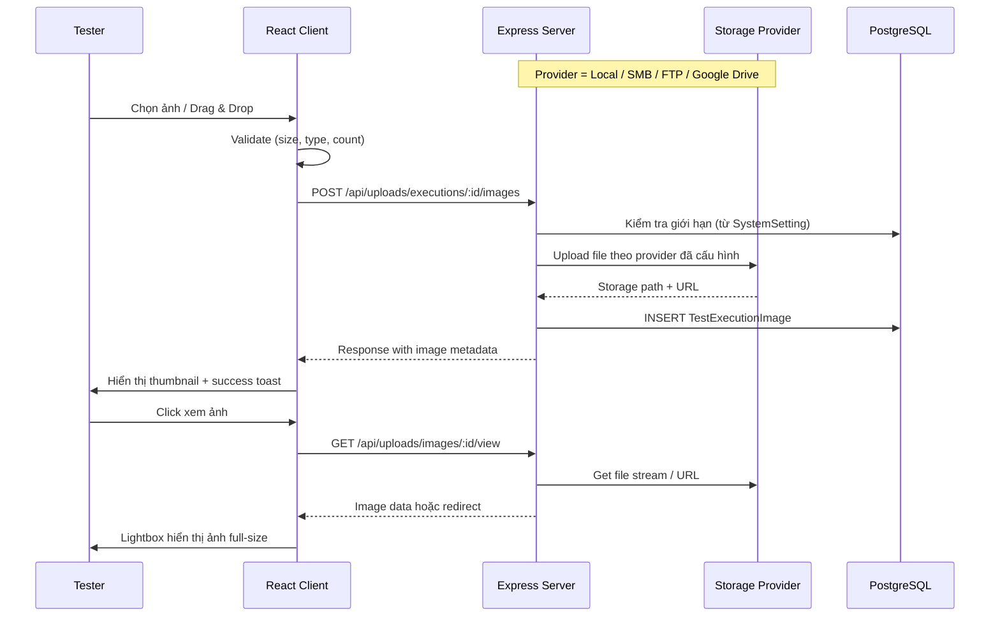
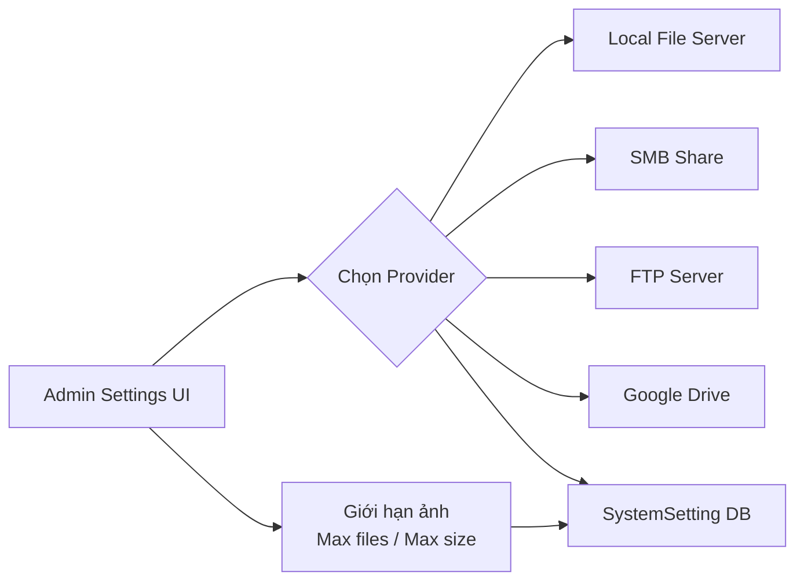

# Bổ sung tính năng Upload Ảnh cho Test Case Execution

## Mô tả
Thêm khả năng upload ảnh (screenshot, evidence) khi thực thi test case. Ảnh minh chứng sẽ được đính kèm vào kết quả thực thi (TestExecution) và lưu trữ linh hoạt qua **4 phương thức** (cấu hình qua Settings):

1. **Local File Server** — lưu file ảnh vào thư mục trên server (mặc định `uploads/`)
2. **SMB (Shared File Server)** — lưu file vào thư mục chia sẻ mạng nội bộ qua giao thức SMB
3. **FTP Server** — upload ảnh lên FTP server
4. **Google Drive** — upload ảnh lên Google Drive qua Service Account

Toàn bộ cấu hình (loại storage, đường dẫn, credentials, giới hạn ảnh) đều được quản lý qua **Settings UI**.

---

## User Review Required

> [!IMPORTANT]
> **Google Drive Service Account**: Để sử dụng Google Drive, bạn cần tạo một Service Account trên Google Cloud Console và tải file `credentials.json`. Upload file này qua Settings UI.

> [!WARNING]
> **Database Migration**: Tính năng này yêu cầu chạy Prisma migration để thêm model `TestExecutionImage`. Nếu production DB đang chạy, cần plan migration cẩn thận.

---

## Proposed Changes

### Database Layer (Prisma)

#### [MODIFY] [schema.prisma](file:///d:/Java%20lean/TestCase/server/prisma/schema.prisma)
- Thêm model `TestExecutionImage` để lưu metadata ảnh:
  ```prisma
  model TestExecutionImage {
    id              String        @id @default(uuid())
    executionId     String        @map("execution_id")
    execution       TestExecution @relation(fields: [executionId], references: [id], onDelete: Cascade)
    filename        String                    // tên file gốc
    storagePath     String        @map("storage_path")  // path local/SMB/FTP hoặc Google Drive file ID
    storageType     String        @map("storage_type")  // "local" | "smb" | "ftp" | "google_drive"
    mimeType        String        @map("mime_type")
    fileSize        Int           @map("file_size")
    publicUrl       String?       @map("public_url")    // URL công khai để xem ảnh
    uploadedAt      DateTime      @default(now()) @map("uploaded_at")

    @@map("test_execution_images")
  }
  ```
- Thêm relation `images TestExecutionImage[]` vào model `TestExecution`

---

### Storage Service Layer (Backend)

#### [NEW] [storageService.ts](file:///d:/Java%20lean/TestCase/server/src/services/storageService.ts)
Provider pattern với 4 implementations:

| Provider | Thư viện | Mô tả |
|---|---|---|
| `LocalStorageProvider` | `fs/path` (built-in) | Lưu vào `uploads/executions/{executionId}/` |
| `SmbStorageProvider` | `@toheaven/samba-client` hoặc copy qua `robocopy`/`xcopy` | Lưu vào SMB share path `\\server\share\...` |
| `FtpStorageProvider` | `basic-ftp` | Upload lên FTP server |
| `GoogleDriveStorageProvider` | `googleapis` | Upload lên Google Drive folder |

Mỗi provider implement interface:
```typescript
interface StorageProvider {
  upload(file: Buffer, filename: string, executionId: string): Promise<StorageResult>;
  delete(storagePath: string): Promise<void>;
  getFileStream(storagePath: string): Promise<{ stream: Readable; mimeType: string }>;
}
```

`StorageFactory` đọc config từ `SystemSetting` (key: `storage_config`) để khởi tạo đúng provider.

#### [NEW] [uploadController.ts](file:///d:/Java%20lean/TestCase/server/src/controllers/uploadController.ts)
- `uploadImages`: POST — nhận multipart files, kiểm tra giới hạn (đọc từ Settings), lưu qua StorageService
- `deleteImage`: DELETE — xóa ảnh khỏi storage + DB
- `getImage`: GET — serve ảnh (local/SMB/FTP) hoặc redirect (GDrive)

#### [NEW] [uploadRoutes.ts](file:///d:/Java%20lean/TestCase/server/src/routes/uploadRoutes.ts)
```
POST   /api/uploads/executions/:executionId/images   — upload ảnh (multipart, max files từ settings)
DELETE /api/uploads/images/:imageId                   — xóa 1 ảnh
GET    /api/uploads/images/:imageId/view              — xem/tải ảnh
```

---

### Server Configuration

#### [MODIFY] [index.ts](file:///d:/Java%20lean/TestCase/server/src/index.ts)
- Import và mount `uploadRoutes`
- Thêm `express.static('uploads')` cho local file serving

#### [MODIFY] [settingController.ts](file:///d:/Java%20lean/TestCase/server/src/controllers/settingController.ts)
Thêm 2 endpoints mới:
- `getStorageConfig` — trả về cấu hình storage hiện tại + giới hạn ảnh
- `saveStorageConfig` — lưu cấu hình storage từ Settings UI

Cấu trúc config lưu trong `SystemSetting` (key: `storage_config`):
```json
{
  "provider": "local",
  "maxFilesPerExecution": 10,
  "maxFileSizeMB": 10,
  "local": {
    "uploadPath": "./uploads"
  },
  "smb": {
    "host": "192.168.1.100",
    "share": "testcase-images",
    "username": "",
    "password": "",
    "domain": ""
  },
  "ftp": {
    "host": "ftp.example.com",
    "port": 21,
    "username": "",
    "password": "",
    "remotePath": "/testcase-images",
    "secure": false
  },
  "googleDrive": {
    "folderId": "",
    "credentials": null
  }
}
```

#### [MODIFY] [settingRoutes.ts](file:///d:/Java%20lean/TestCase/server/src/routes/settingRoutes.ts)
- `GET  /api/settings/storage` — đọc cấu hình storage
- `POST /api/settings/storage` — lưu cấu hình storage
- `POST /api/settings/storage/test` — test kết nối storage

#### [MODIFY] [executionController.ts](file:///d:/Java%20lean/TestCase/server/src/controllers/executionController.ts)
- Cập nhật queries để include `images` relation

#### [MODIFY] [testCaseController.ts](file:///d:/Java%20lean/TestCase/server/src/controllers/testCaseController.ts)
- Cập nhật getSuites, getSuiteById để include `executions.images`

#### [MODIFY] [package.json](file:///d:/Java%20lean/TestCase/server/package.json)
Thêm dependencies:
```json
"googleapis": "^144.0.0",
"basic-ftp": "^5.0.5"
```

> [!NOTE]
> Cho SMB, sẽ dùng `child_process` gọi `net use` + `robocopy` (Windows) hoặc `smbclient` (Linux) thay vì dependency riêng, vì các thư viện SMB cho Node.js không ổn định. Đây là cách tương thích tốt nhất trên Windows server.

---

### Client Side (React)

#### [MODIFY] [types/index.ts](file:///d:/Java%20lean/TestCase/client/src/types/index.ts)
```typescript
export interface TestExecutionImage {
  id: string;
  executionId: string;
  filename: string;
  storagePath: string;
  storageType: string;
  mimeType: string;
  fileSize: number;
  publicUrl?: string;
  uploadedAt: string;
}

// Cập nhật TestExecution:
// + images?: TestExecutionImage[];

export interface StorageConfig {
  provider: 'local' | 'smb' | 'ftp' | 'google_drive';
  maxFilesPerExecution: number;
  maxFileSizeMB: number;
  local: { uploadPath: string };
  smb: { host: string; share: string; username: string; password: string; domain: string };
  ftp: { host: string; port: number; username: string; password: string; remotePath: string; secure: boolean };
  googleDrive: { folderId: string; credentials: any };
}
```

#### [MODIFY] [services/api.ts](file:///d:/Java%20lean/TestCase/client/src/services/api.ts)
- Thêm `uploadApi`: `uploadImages()`, `deleteImage()`, `getImageUrl()`
- Thêm `storageApi`: `getConfig()`, `saveConfig()`, `testConnection()`

#### [NEW] [ImageUploader.tsx](file:///d:/Java%20lean/TestCase/client/src/components/ImageUploader.tsx)
Component upload ảnh tái sử dụng:
- Drag & Drop zone với visual feedback
- File picker (accept `image/*`)
- Preview thumbnails grid
- Upload progress bar per file
- Delete button per image
- Hiển thị `{current}/{max}` ảnh đã upload
- Validation: kiểm tra file size, file type, số lượng

#### [NEW] [ImageLightbox.tsx](file:///d:/Java%20lean/TestCase/client/src/components/ImageLightbox.tsx)
- Modal overlay xem ảnh full-size
- Navigation prev/next giữa các ảnh
- Zoom in/out
- Nút download

#### [MODIFY] [ExecutionDrawer.tsx](file:///d:/Java%20lean/TestCase/client/src/components/ExecutionDrawer.tsx)
Thêm section **"📸 Ảnh minh chứng (Evidence Screenshots)"** trong phần ghi nhận kết quả:
- Tích hợp `ImageUploader` component
- Hiển thị ảnh đã upload của execution hiện tại
- Click ảnh → mở `ImageLightbox`

#### [MODIFY] [Settings.tsx](file:///d:/Java%20lean/TestCase/client/src/pages/Settings.tsx)
Thêm tab/section **"📁 Cấu hình lưu trữ ảnh"**:
- Radio/dropdown chọn provider: Local | SMB | FTP | Google Drive
- Form fields động theo provider được chọn:
  - **Local**: Đường dẫn thư mục
  - **SMB**: Host, Share name, Username, Password, Domain
  - **FTP**: Host, Port, Username, Password, Remote path, Secure (FTPS)
  - **Google Drive**: Folder ID, Upload credentials JSON
- **Giới hạn ảnh** (áp dụng cho tất cả provider):
  - Số ảnh tối đa mỗi execution (input number, mặc định 10)
  - Kích thước tối đa mỗi ảnh (input number MB, mặc định 10)
- Nút **"Kiểm tra kết nối"** (Test Connection)
- Nút **"Lưu cấu hình"**

---

## Tóm tắt luồng hoạt động





---

## Verification Plan

### Automated Tests
```bash
cd server
npx prisma migrate dev --name add_execution_images
npx prisma generate
npm run build
cd ../client
npm run build
```

### Manual Verification
- Upload ảnh với **Local** provider → xác nhận file tồn tại trong `uploads/`
- Chuyển sang **SMB** → upload ảnh → xác nhận file xuất hiện trên share
- Chuyển sang **FTP** → upload ảnh → xác nhận file trên FTP server
- Chuyển sang **Google Drive** → upload ảnh → xác nhận file trên Drive folder
- Thay đổi giới hạn ảnh trong Settings → xác nhận validation hoạt động
- Xóa ảnh → xác nhận ảnh bị xóa khỏi cả storage và DB
- Xem ảnh full-size qua lightbox
- Test Connection cho từng provider
